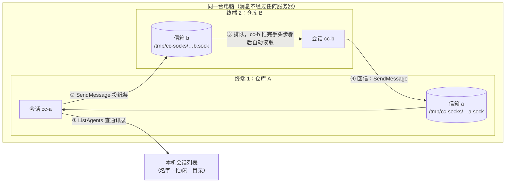
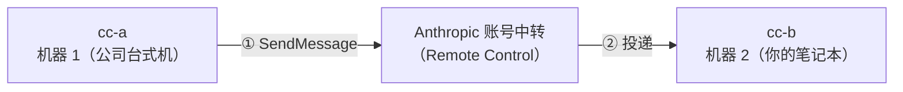

# Claude Code 跨会话通信（Cross-Session Messaging）入门

> 面向小白的原理与使用说明。写于 2026-09-22，对应 Claude Code v2.1.224+（2026-08-07 引入该功能）。

## 一句话总结

你可以在终端 1 开一个 Claude Code 会话（仓库 A），在终端 2 再开一个（仓库 B），然后让它们**互相发消息**——就像给同事发微信一样，不需要你自己来回复制粘贴。

## 它能干什么？典型场景

| 场景 | 以前的做法 | 现在的做法 |
|---|---|---|
| 仓库 A 的会话改了接口，想知道仓库 B 的会话适配完没有 | 自己切终端看、口头转述 | 直接问：「问问 cc-b 适配完没有」 |
| 一个会话在跑长任务（构建/迁移），你想在另一个会话里知道进度 | 手动轮询 | 「迁移跑完了告诉我」（`notify_when_idle`） |
| 并行开多个 worktree 干活，谁先做完谁交接 | 人肉传话 | 完工的会话直接把结论发给下一个 |

## 前提条件

- **版本**：两端都 ≥ **v2.1.224**（Windows 原生支持要 ≥ v2.1.239）
- **范围**：同一台机器上的会话开箱即用（macOS / Linux / WSL2）；**跨机器**需通过 Remote Control
- **配置**：无需任何配置，启动就能用（但有几种隐私环境变量会静默关闭它，见[常见坑](#常见坑)）

---

## 原理：每个会话都有一个带锁的信箱

用一个办公室的比喻来理解：

- 每个会话 = 一位坐在工位上的员工（Claude + 你的对话）
- **信箱**：会话一启动，就在本机创建一个专属的「信箱」——技术上是一个 Unix socket 文件（Linux/macOS，如 `/tmp/cc-socks/38590.sock`；Windows 是命名管道）。**权限是仅本用户可读写**，所以同一台电脑的其他用户碰不到你的信箱
- **通讯录**：`ListAgents` 工具能列出本机所有可达的会话（名字、忙/闲状态、所在目录）
- **传纸条**：`SendMessage` 工具把一条**纯文本**消息投进对方信箱。纸条上只有文字——**不带**你的对话历史、不带文件、不带权限

本机通信的完整链路：



### 消息是怎么被「收到」的？

接收方**不会**被打断。消息先进信箱排队；当 cc-b 结束手头这一轮工作（或处于空闲）时，消息自动出现在它的对话里，长这样：

```
<cross-session-message from="agent-platform-manager-42">
  迁移跑完了吗？
</cross-session-message>
```

cc-b 的 Claude 会把它当成一条新的用户输入来处理——但它**只是输入，不是命令**（详见[安全边界](#安全边界：纸条是输入，不是授权)）。

### 跨机器怎么算？

跨机器没有本地信箱可投，走 **Remote Control**（你的 Claude 账号）中转：



注意：**云端会话目前只能收不能回**——它能读到你的消息并干活，但无法主动回信。

---

## 手动还是自动？

**答案是：都有，分工不同。** 这个功能分「发」和「收」两端：

| 环节 | 谁触发 | 说明 |
|---|---|---|
| **发送** | 大多由你发起（手动） | 你用自然语言让会话发消息，它会自己调用 `SendMessage` |
| **发送** | 也可以是 Claude 自主（自动） | 干活过程中它判断需要同步信息时，可以自己发（比如子任务完成时交接结论） |
| **发送** | `@` 提及（手动，v2.1.232+） | 输入框里敲 `@会话名`，直接点名另一个会话 |
| **发送** | 空闲通知（半自动，v2.1.236+） | `notify_when_idle`：向对方订阅一次「你忙完了叫我」，对方空闲/退出时自动送达一条通知，仅一次，不是轮询 |
| **接收** | 自动 | 消息进信箱排队，对方忙完自动读取，无需确认（默认 `accept` 模式） |

一句话：**信箱常开（自动收），纸条要有人递（你递，或 Claude 判断该递时递）。** 没有「两个会话自动持续同步上下文」这种事——同步的只有一条条离散的文本消息。

---

## 使用方式

### 入口 1：自然语言（最常用）

直接用人话指挥会话即可，不用记任何命令：

```text
❯ 帮我查一下有哪些会话，然后把「接口已改成 v2」这句话发给仓库 B 那个
```

Claude 会自动执行：先 `ListAgents` 查列表 → 选中目标 → `SendMessage` 投递 → 告诉你结果。

### 入口 2：斜杠命令

- `/list-agents`（别名 `/peers`）：查看本会话名字 + 所有可达会话
- `/status`：查看本会话信箱地址（`Peer address` 行，`uds:` 开头）
- `/rename` 或启动时 `--name xxx`：给会话起个好记的名字（不取则按目录自动生成，如 `agent-platform-manager-42`）

### 入口 3：`@` 提及（v2.1.232+）

在输入框里敲 `@`，可以点名另一个活跃会话，Claude 直接给它发消息。

---

## 实战示例：仓库 A ↔ 仓库 B

**终端 1（仓库 A 的会话 cc-a）：**

```text
❯ /list-agents
This session is agent-platform-manager-42 [31b260] — the name other
sessions use to message it (it is not listed below; a message to it
would be a message to yourself).

Peer sessions (2):
  agent-platform-manager-08 [c018fd]  ·  interactive  ·  busy  ·  started 13m ago
  agent-platform-manager-57 [9256d3]  ·  interactive  ·  busy  ·  started 5m ago
```

第一行是「我自己叫什么」（别人用这个名字找到我），下面是可达的同伴。

```text
❯ 问一下 agent-platform-manager-08，fastgpt 工具名那个工单完成没有
```

Claude 在 cc-a 内部执行 `SendMessage(to: "agent-platform-manager-08", message: "fastgpt 工具名工单（工单01）完成了吗？")`。

**终端 2（仓库 B 的会话 cc-b，此刻正忙别的）：**

消息先在信箱排队；cc-b 结束当前这轮工作后，对话里自动出现：

```text
<cross-session-message from="agent-platform-manager-42">
  fastgpt 工具名工单（工单01）完成了吗？
</cross-session-message>
```

cc-b 处理后回信：`SendMessage(to: "agent-platform-manager-42", message: "已完成并合入 llmsec 分支，commit ef4ab28")`。

**回到终端 1，cc-a 转述给你：**

```text
cc-b 回复：工单已完成并合入 llmsec 分支（commit ef4ab28）。
```

### 示例 2：等对方忙完再通知我（`notify_when_idle`）

```text
❯ 订阅一下 agent-platform-manager-57 的空闲通知，它停下来就告诉我
```

cc-a 发出一次性订阅；当 cc-b 侧的 `agent-platform-manager-57` 空闲（或退出）时，cc-a 收到一条通知。**只有一次**，不是持续监听。

---

## 安全边界：纸条是输入，不是授权

这是设计上最重要的一条。收到消息的会话会**读**它、**理解**它，但消息本身：

| 能 | 不能 |
|---|---|
| 被读进对话、被讨论、被当作任务线索 | ❌ 替你批准任何权限弹窗（对方该弹的还是会弹） |
| 触发对方开始一项工作（仍要走它自己的正常流程） | ❌ 修改对方的配置、设置 |
| 携带文字信息（结论、状态、要点） | ❌ 执行任何命令、携带文件或代码附件 |
| | ❌ 带上发送方的对话历史——对方看不到你们聊过什么 |

另外，权限审批是**各会话独立**的：cc-a 被你拒绝过的操作，不能靠让 cc-b「代劳」绕过去。

## 限制与配额

| 项 | 规则 |
|---|---|
| 待读上限 | 每个会话信箱最多存 **50** 条待处理消息 |
| 限速 | 按发送方限速；短时间内的**重复相同消息**会被直接丢弃（防止两个会话互相「你收到没？」刷屏死循环） |
| 大小 | 超大消息会被拒绝发送（v2.1.235 起明确报错，不再静默丢失） |
| 回执 | v2.1.238 起投递状态诚实回报：对方拒收/信箱满了会告诉你「refused」，而不是假装修送到了 |

## 常见坑

1. **静默被关**：以下隐私环境变量在特定取值下会关掉整个功能且无提示——`CLAUDE_CODE_DISABLE_NONESSENTIAL_TRAFFIC`、`DISABLE_TELEMETRY`、`DO_NOT_TRACK`、`DISABLE_GROWTHBOOK`。列表查不到会话时先查它们
2. **版本不一致**：一边 < v2.1.224 就互相看不见；Windows 老版本（< v2.1.239）不可用
3. **重名混淆**：两个会话同名时，v2.1.232 起新来的会被自动改名成 `name-word-word` 变体；列表里也会带短标识（如 `[c018fd]`）帮助区分
4. **对方 busy ≠ 收不到**：消息会排队，只是要等它忙完这轮才被读
5. **云端会话只收不发**：不要让 Claude「等云端会话回信」——它回不了

## 常见误区 FAQ

**Q：这和会话内的子代理（subagent）是一回事吗？**
不是。子代理是**同一个会话内部**的帮手，和主会话共享上下文、干完活把结果交回来。跨会话通信连接的是两个**完全独立**的对话，彼此的历史互相不可见。

**Q：和 Agent Team 什么区别？**
Agent Team 是一个会话「组队」拉起来的固定队友，队内走结构化协议、共享任务状态。跨会话通信是平级的独立会话之间递**纯文本**纸条，轻量但没有团队管理。

**Q：我的代码、文件会因此泄露给对方会话吗？**
不会自动传。对方只能看到消息文本里**明确写了**的内容；如果 cc-b 需要看代码，它去自己读自己目录下的文件。

**Q：消息经过 Anthropic 服务器吗？**
同机通信**不经过**——走的是本机 socket，内容不出你的电脑。只有跨机器（Remote Control）那条路会经过账号中转。

## 版本时间线

| 版本 | 变化 |
|---|---|
| v2.1.224 | 功能发布：跨会话 `SendMessage` + `ListAgents`（macOS/Linux）；新增 `crossSessionInbound`、`dialogExpiry` 设置 |
| v2.1.225 | 可按名字向其他机器的 Remote Control 会话**发起**对话（此前只能回复）；headless 会话的挂起消息有到期时间 |
| v2.1.232 | 会话名强制唯一（冲突自动改名）；输入框 `@` 提及；`/config` 新增「来自其他会话的消息」开关（`accept` / `hold` / `refuse`）；加固共享 `/tmp` 下的 socket 目录安全 |
| v2.1.235 | 超大消息发送前明确报错 |
| v2.1.236 | `notify_when_idle` 一次性空闲/退出通知；突发超量消息发送前拦截 |
| v2.1.238 | 投递诚实回报（拒收/信箱满明确告知发送方） |
| v2.1.239 | Windows 原生支持（命名管道）；`/list-agents` 显示本会话名；列出 agent-team 队友 |

## 参考链接

- [Cross-Session Messaging in Claude Code — Blake Crosley](https://blakecrosley.com/blog/claude-code-cross-session-messaging)（机制详解，含版本考据）
- [Claude Code Cross-Session Messaging: How It Works — AI Catchup](https://aicatchup.com/news/claude-code-cross-session-messaging)
- [Message your other Claude Code sessions — daily.dev](https://daily.dev/posts/message-your-other-claude-code-sessions-g010l5qll)
