# mattpocock/skills：设计哲学与使用指南（通俗版）

> 分析对象：<https://github.com/mattpocock/skills>（截至 2026-09-15 的 main，插件版本 1.2.3）。
> 本仓（aha）装的就是这一套 skill，所以这份文档既帮你读懂上游，也帮你读懂自己手里这套工具。
> 图表用 mermaid / ASCII 画，GitHub 和 VS Code 预览都能渲染。
> **读法**：第 1–4 节讲机制（每个 skill 是什么、为什么这么设计）；第 5 节讲场景（六种常见开发任务各走哪条路）；第 10 节是速查表。只想知道「我现在该敲什么」可以直接跳第 5 节或第 10 节。

---

## 0. 这是什么：一套刀具，不是一台料理机

作者 Matt Pocock（TypeScript 圈最有名的教学者之一，Total TypeScript 和 AI Hero 两个课程的作者）把自己日常用的编码 agent 技能集开源了，口号是 **"Skills for Real Engineers"**——给 Claude Code、Codex 这类编码 agent 用的、干真工程的技能，不是玩票的玩具。

先说它**反对什么**。市面上有一类「全流程接管型」框架（README 点名的有 GSD、BMAD、Spec-Kit），思路是「你把项目交给我，流程我来安排」。听起来省心，代价是你交出了控制权：流程里出了问题，你既不知道它在干什么，也很难把它掰回正道。就像一台多功能料理机——看起来什么都能做，但做出来的味道不对时，你连盖子都打不开。

这套 skill 刻意反着来：**每把都是小刀**——小、好改、能单独拆下来用。README 原话欢迎你 "hack around with them, make them your own"（随便改，改成你自己的）。

本仓就是活例子：aha 的 CLAUDE.md 规定的「新需求一律 ADR / CONTEXT → `/to-spec` → `/to-tickets`」，用的就是这套的上游版本（细节差异见第 12 节）。

---

## 1. 哲学：对着四个最常见的翻车现场，各开一副药

这套 skill 不是拍脑袋设计的。它先列出 agent 干活最常见的四种翻车，再一个一个给解法。README 给每种翻车都配了一句经典著作的话——意思是「每副药都是老道理的新包装」。

| # | 翻车现场 | 你看到的症状 | 药方 | 出处 |
|---|---------|------------|------|------|
| ① | **agent 没听懂你要啥** | 你以为它懂了，看到产出才发现它根本没理解你 | 拷问会话（grilling）：动手前让它把你问透 | 《程序员修炼之道》："没有人确切知道自己想要什么" |
| ② | **agent 太啰嗦、说黑话** | 20 个词说 1 个词能说清的事；项目黑话它得现猜 | CONTEXT.md 词汇表 + ADR 决策记录，统一项目语言 | Evans《领域驱动设计》：对话和代码从同一个领域模型派生 |
| ③ | **代码跑不起来** | agent 等于闭眼开车——不知道自己写的东西跑起来什么样 | 反馈三件套：类型、浏览器、自动化测试；测试先行；纪律化调试 | 《程序员修炼之道》："反馈的速度就是你的速度上限" |
| ④ | **代码越写越烂** | agent 写码越快，烂得越快，复杂度加速堆积 | 深模块设计（小接口藏大实现）+ 定期架构巡检 | Kent Beck："每天投资于系统设计"；Ousterhout："最好的模块是深的" |

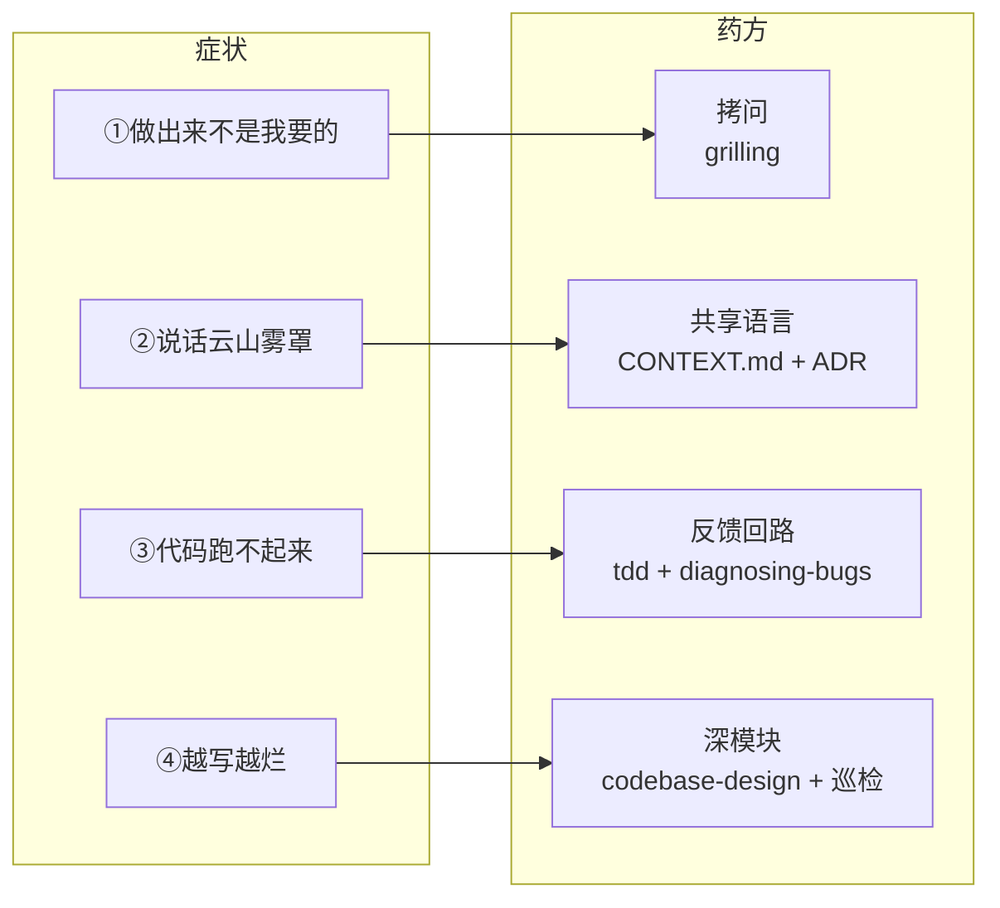

对号入座一下，四种翻车你大概率都见过：

- ① 你说「加个登录」，它给你上了一整套第三方平台授权登录，而你只想加个内部账号密码。
- ② 它的回复里满是「这个 interacts with 那个 module，通过 event bus 异步解耦」——你们项目根本没有 event bus，它现编的词现用。
- ③ 它写完一个函数，自信满满地说「应该可以了」——它没跑过，一行都没跑过。
- ④ 三周后新功能越来越难加：改一个字段要碰八个文件，没人说得清哪个文件管什么。

### 1.1 贯穿一切的一条元原则：反馈速度就是你的速度上限

这条出自《程序员修炼之道》，是整个体系的心跳：

- 对人类开发者：小步走、每步都有反馈，快过憋一个大招。
- 对 agent：同理，而且更狠。没有测试回路，agent 写的是「想象中能跑」的代码；有一条 2 秒内能变红的测试回路，它写的就是「验证过能跑」的代码。第 4.2 节的 diagnosing-bugs 把这条推到极致——「建好正确的反馈回路，bug 就修好了 90%」。

用数字感受一下差别：

```text
反馈要 30 分钟（全量构建 + 真机）：一天最多试 16 次，每次都靠祈祷
反馈要 2 秒（单测文件）         ：一天能试上千次，错了立刻知道错在哪
```

速度上限不是你的脑力，是回路的速度。

### 1.2 元层的元层：写给 agent 的文档也是门手艺

这套 skill 自己就是用一门「写给 agent 的写作学」造出来的（`writing-for-agents` skill，第 8 节详述）。理解了这个，才能理解它很多看似奇怪的设计，比如：

- 为什么 user-invoked skill 的 description 里**故意不写触发词**（那是给人看的摘要，不是给模型的路标）；
- 为什么全仓到处都是 `tracer bullet`、`fog of war`、`red`、`tight`、`relentless` 这些反复出现的**词**——它们是「引导词」（leading word），借模型预训练里已经有的概念，一个词顶一段话。

---

## 2. 骨架：25 个 skill 怎么分类

### 2.1 两根分类轴

**第一根轴：按内容分两个桶**（都是随插件分发的正式成员，上游叫 promoted）：

- **engineering**（18 个）：每天写代码用的。
- **productivity**（7 个）：跟代码无关的通用工作流（拷问、教学、交接之类）。

除这两个桶外，仓库里还有三个不发版的桶：`in-progress`（试水的 beta，含 implement-spec、retro 和写作系列等 8 个）、`misc`（作者自留工具 4 个）、`deprecated`（目前是空的——**退役的 skill 直接删掉**，在 changeset 里写明谁接替，不留尸体）。

**第二根轴：按「谁能点火」分两类**。这是全仓最关键的一根分类，专门写在 `.agents/invocation.md` 里：

- **user-invoked（人扣扳机）**：只有人敲 `/名字` 才会跑。
- **model-invoked（模型自己够）**：人可以敲，模型匹配到场景也会自己调。

用开车打比方：user-invoked 是手动挡，离合器只有你踩得动；model-invoked 是自动巡航，模型觉得路况合适就自己挂上。

| | user-invoked（人扣扳机） | model-invoked（模型自己够） |
|---|---|---|
| 谁能调 | **只有人**敲 `/名字` | 人可以敲，**模型匹配到场景也会自动调** |
| 怎么实现 | 配置文件里写死开关：Claude Code 的 frontmatter 加 `disable-model-invocation: true`，Codex 的 `agents/openai.yaml` 加 `policy.allow_implicit_invocation: false` | 不写这些开关；description 写满触发词，让模型好匹配 |
| description 给谁看 | 给**人**看的一行摘要，触发词全删掉 | 给**模型**看的路标，写着 "Use when the user says…" |
| 上下文开销 | 零（模型根本看不见它） | 常驻上下文（description 每回合都占 token） |
| 认知开销 | 花在**人**身上：你得记住它存在 | 零 |
| 装的是什么 | **编排**（orchestration）：流程的阶段切换点 | **纪律**（discipline）：可复用的干活方法 |
| 判断标准 | 这个时刻**必须由人做主** | 「模型自主够这个 skill 来用，有没有用？」 |

**两条铁律**（`.agents/invocation.md` 原文级别的不变量）：

1. user-invoked 的 skill，模型和用户之外**谁都调不动**——包括其他 skill。哪怕 skill A 的正文里白纸黑字写着「接下来去调 skill B」（B 是 user-invoked），也调不着：模型在它的可见清单里根本找不到 B。
2. user-invoked 可以调 model-invoked 的；反方向**永远不行**。

铁律 1 有个真实后果：`implement`（人扣扳机的）干到一半发现票切错了，它**不能自己跑 `/to-tickets` 重切**——它够不着。唯一正确的动作是停下来，请人去敲 `/to-tickets`。这就是「编排权在人」的具体含义。

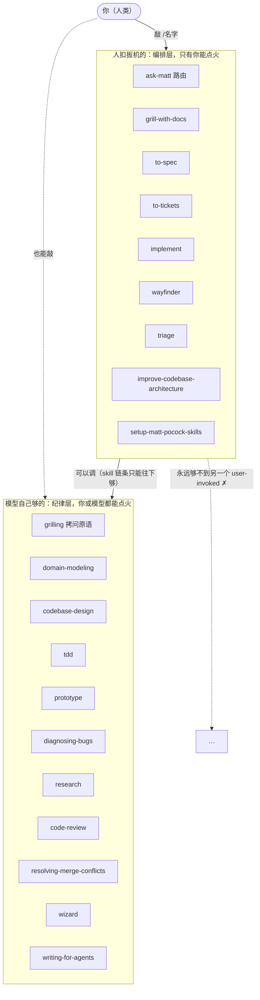

**实锤：本会话里就能验证这套机制在生效。** 我（模型）当前能看到的 skill 恰好就是下面那一格的 11 个加上本仓两个自有 skill；`to-spec`、`to-tickets`、`grill-me` 在我这边**根本不出现**——不是「不建议我用」，是物理上看不见。

### 2.2 全量清单（25 个）

**Engineering — 人扣扳机（9 个）**

| Skill | 一句话 | 关键点 |
|---|---|---|
| `ask-matt` | 不记得该用啥？问它。全仓库的路由器 | 只给指路，从不代跑（它也跑不了，见铁律） |
| `grill-with-docs` | 拷问 + 顺手把结论落成 CONTEXT.md / ADR | 有仓库就用它，比 grill-me 强在留下纸面记录 |
| `to-spec` | 把聊透的东西固化成规格说明，发布到 tracker | **禁止再访谈**，只综合已讨论的内容 |
| `to-tickets` | 把计划 / spec / 对话切成曳光弹票 + 阻塞边 | 发布前必须用户点头 |
| `implement` | 按票施工，内部驱动 tdd，收尾跑 code-review | 自己不造票（也造不了，见铁律） |
| `wayfinder` | 特大号迷雾工程：决策票地图，逐票清除 | 产决策不产代码，图清了回主流程 |
| `triage` | 外来 issue / PR 过分诊状态机 | 外来件才 triage，自己切的票别 triage |
| `improve-codebase-architecture` | 扫码库找「加深模块」的机会，出 HTML 报告 | 调查报告，不是救援队；几天跑一次 |
| `setup-matt-pocock-skills` | 一次性配置：tracker / 分诊标签 / 文档布局 | 每仓跑一次，其他 skill 的前置 |

**Engineering — 模型自己够（9 个）**

| Skill | 一句话 | 关键点 |
|---|---|---|
| `prototype` | 一次性代码回答一个设计问题 | 逻辑题→单文件 HTML；UI 题→多变体切换 |
| `diagnosing-bugs` | 疑难 bug 的纪律化调试循环 | 没有红的测试回路之前，禁止提假说 |
| `research` | 后台子代理查一手资料，落成带引用的 md | 你继续干活，它负责读 |
| `tdd` | 红绿重构循环 + 好坏测试判据 | 只在预先约定的接缝上测 |
| `domain-modeling` | 主动维护领域模型：挑刺、场景压测、落盘 | CONTEXT.md 只当词汇表，别当杂物抽屉 |
| `codebase-design` | 深模块设计的共享词汇与原则 | module / interface / depth / seam / adapter… |
| `code-review` | 双轴审查：Standards + Spec，并行子代理 | 两轴分开报，绝不合并排序 |
| `resolving-merge-conflicts` | 逐块按意图解冲突 | 永不 `--abort`，不发明新行为 |
| `wizard` | 生成 bash 向导，带人过只有人能做的步骤 | agent 撞到「只有人能过」的墙时自己会抓它 |

**Productivity — 人扣扳机（5 个）**

| Skill | 一句话 | 关键点 |
|---|---|---|
| `grill-me` | 被拷问到设计树每个分支都定下来 | 无状态版拷问：没有工作目录、不打算留档时用它 |
| `handoff` | 把当前对话压缩成交接文档 | 只在「要出远门」时用，窄门 |
| `teach` | 多会话教学，目录就是有状态的学习工作区 | MISSION / 课程 / 参考卡 / 学习记录 |
| `to-questionnaire` | 把答不了的问题做成问卷寄给别人 | 拷问「寄信」不拷问主题 |
| `wait-what` | 「等等我没听懂」——让 agent 换个大白话重讲 | 用 ASD-STE100 简明技术英语 + 你的 CONTEXT.md 词汇 |

**Productivity — 模型自己够（2 个）**

| Skill | 一句话 | 关键点 |
|---|---|---|
| `grilling` | 拷问原语本体：轮次 + 设计树前沿 | 五个 skill 的共用底座 |
| `writing-for-agents` | 写给 agent 消费的文档怎么写 | 整个仓库的「文风法典」 |

### 2.3 记不住怎么办？路由器 + 文档页

人扣扳机的 skill 全部零上下文开销，但代价是**人脑当索引**。两招补救：

- **路由器 skill（router skill）**：`ask-matt` 本身也是人扣扳机的，它一张嘴讲清所有流程——你只要记得「不知道就问 matt」这一个入口。它只**指路**（「这种情况去跑 /to-spec」），从不**代跑**。
- **人读的文档页**：每个正式 skill 在 `docs/<bucket>/<name>.md` 有四段式页面（它干什么 / 什么时候想到它 / 常见问题 / 怎么判断它起作用了），发布在 aihero.dev。这些页面合起来是「分布式路由器」。

上游还有一条洁癖规矩：**全仓行文禁用长破折号（em-dash）**，句子要什么标点就用什么标点，不许无脑字符替换——写给 agent 的文档里连标点都要有纪律。

---

## 3. 主工作流：一个想法怎么走到上线

这是整套系统的主干（`ask-matt` 叫它 "the main flow"）。先把流水线看一眼：

**拷问（想清楚）→（聊不定的先做原型）→ spec（写成文）→ 切票（切成小块）→ 施工（逐票写、逐票审）**。每个阶段切换点都是人扣扳机——这就是 2.1 节说的「编排权在人」。

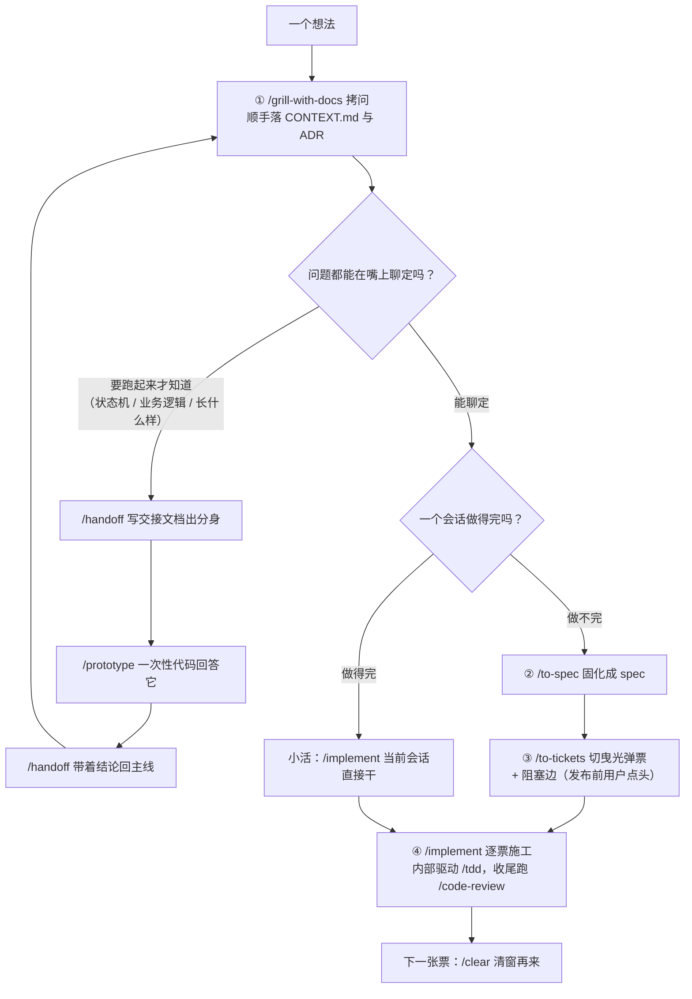

### 3.1 第①步：grilling——拷问（翻车①的解药）

`grilling` 是全仓最核心的原语，五个 skill 靠它驱动（`grill-me`、`grill-with-docs` 直接包它，`triage`、`wayfinder`、`improve-codebase-architecture` 内部调它）。机制四件套：

**（1）把待定的决策画成一棵设计树。**每个决策分叉出挂在它下面的决策。以「给管理后台加一个报表导出功能」为例，拷问进行到一半时，这棵树可能长这样：

```text
报表导出（根决策）
│
├─ ✅ 导出格式 → 定了：先只做 CSV
│    ├─ ❓ CSV 编码用 UTF-8 还是 GBK？     ← 前提齐了，现在就能问
│    └─ ⛔ 超大报表要不要分片？             ← 等「单文件上限」定了才能问
│
├─ ❓ 数据范围：当前用户还是全租户？        ← 前沿，现在就能问
├─ ❓ 同步下载还是异步发邮件？             ← 前沿，现在就能问
└─ ⛔ 导出记录要不要进审计日志？           ← 等「同步/异步」定了才有意义
```

- ✅ 已定下来的决策。每定一个，它下面挂着的新问题就**解锁**了。
- ❓ **前沿（frontier）**：前提全部落定、**现在就能问**的问题。
- ⛔ 被挡住的：它的前提里还有没定的决策，现在问了只能瞎猜。

**（2）按轮次干活，一轮问完整个前沿。**每个问题编号并附上 agent 的**推荐答案**，然后停下来等你的答复：

> ❓ **Q1** - **数据范围**：导出只含当前用户的数据，还是整个租户？
> ➡️ 推荐整个租户：这个功能看起来是运营用的，运营要看大盘。
>
> ❓ **Q2** - **导出方式**：同步下载，还是异步生成后发邮件？
> ➡️ 推荐同步：内部报表数据量不大，异步链路（生成、存储、通知）不值得建。
>
> ❓ **Q3** - **权限**：谁能导出？
> ➡️ 推荐沿用现有「报表查看」权限：不引入新角色。

**（3）你的回答重塑这棵树。**Q2 定了「同步」，于是「单文件数据量上限」解锁了；Q3 定了「沿用权限」，原来挂在它下面的「要不要新角色权限矩阵」整棵分支直接砍掉。第二轮 agent 重算前沿，只问新解锁的：

> ❓ **Q4** - **单文件上限**：导出超过 10 万行怎么办？
> ➡️ 推荐硬截断并提示：真有这个量级该走数据仓库，不该走后台导出。

注意 Q4 为什么不在第一轮问——它依赖 Q2 的答案（同步才有「文件大小」问题）。**答案依赖本轮另一个未决问题的问题，属于下一轮，不属于本轮。**

**（4）铁分工：事实是 agent 的活，决策是你的活。**

- 前沿里如果有问题需要查环境（翻代码、查文件、看配置），agent 派子代理去查，**不许反过来问你**「你们项目现在用什么测试框架」——这是它自己能查到的。
- 但每个**决策**必须摆到你面前等你拍板，agent 不许替你选：「CSV 还是 Excel」不是它翻代码能翻出来的，这是你的判断。
- 查事实也不阻塞提问：等子代理回报的只有挂在它下游的问题，前沿其余的照问。

**收工标准：前沿清空**——设计树每个分支都走到，没有留下任何「默认就这么算了」的假设。而且**用户确认达成共识之前，不许动手干活**。

`grill-me` 和 `grill-with-docs` 的区别只有一条：后者会同时调 `domain-modeling`，把拷问中敲定的术语写进 `CONTEXT.md`、把够格的决策写成 ADR。**有工作目录时永远用后者**——同样的访谈，还白落一份纸面记录。

### 3.2 中场岔路：prototype——嘴上聊不定的问题

如果某个问题「说理论证不动」——状态机对不对、这个页面长什么样——主流程在这里分岔：先做原型，验证完回来。

**为什么要出分身（/handoff 双向桥）**：原型代码有自己的目录，跟主线会话天然隔离。出分身的动作是 `/handoff`——把当前对话压缩成一份交接文档，开个全新会话对着它干；做完再把结论带回来。

**`/prototype` 的核心定义一句话：「一次性代码，回答一个问题。问题决定形态。」**它分两个分支：

**分支一：逻辑题**（状态机、业务规则）→ 做成**单个自包含 HTML 文件**，页面结构是固定的：

```text
┌─────────────────────────────────────────────┐
│ 顶部：本页要探索的问题                        │
│      （例：「订单能在取消后恢复吗？」）        │
├─────────────────────────────────────────────┤
│ 中间：完整状态面板                            │
│  （每次点击后整个重渲染，高亮「刚变了什么」）    │
├─────────────────────────────────────────────┤
│ 下面：自由试的按钮 + 分页签的引导剧本           │
│  剧本场景 1：「已支付 → 取消 → 申请退款」       │
│    依次点：[支付] [取消] [申请退款] …          │
└─────────────────────────────────────────────┘
```

两个要点：

- **逻辑本体是一个纯模块**（reducer / 状态机 / 纯函数集），页面只是壳。问题验证完，这个纯模块可以直接搬进真代码。
- 做成零依赖、双击就能打开的 HTML，意味着**产品经理、设计师、领域专家都能玩**——对齐不再只发生在你和 agent 之间。

**分支二：UI 题**（页面长什么样）→ 在同一路由上放 **3 个（上限 5 个）结构上彻底不同**的变体，`?variant=` 参数切换，底部浮动切换条支持左右方向键。强偏好「嵌进现有页面」：真 header、真数据、真信息密度，才暴露真问题。

**「三个只换了配色的卡片栅格不是原型，是壁纸。」**反馈的常见收获是「我要 B 的头 + C 的侧栏」——这种杂交结论，只有在真变体摆在眼前时才提得出来。

**共同纪律**：从名字开始就承认自己是一次性的；零依赖可跑；默认不持久化；不上测试、不搞抽象（「需要测试的原型已经不是原型」）。做完后**原型本身升格为一手史料**：提交到 `prototype/<name>` 一次性分支，实施票上留指针，主分支只留验证过的结论。

### 3.3 第②③步：to-spec 与 to-tickets——从讨论到可施工

**`/to-spec`（把讨论固化成规格说明）**

定义性约束一句话：**「不访谈，只综合」**。它像会后整理纪要的人：把你们已经聊透的东西整理成文，但**不问你任何新问题**。（全程唯一一次确认：测试接缝选得对不对。）

过程：探索仓库 → 用项目词汇表的语言写 → 尊重相关 ADR → 按模板产出 → 发布到 issue tracker 并打 `ready-for-agent` 标签。

模板六件套：

| 段落 | 装什么 |
|---|---|
| Problem Statement | 要解决什么问题 |
| Solution | 怎么解决 |
| User Stories | 一个长编号清单，格式 `As a <角色>, I want <功能>, so that <价值>`（例：As a mobile bank customer, I want to see balance on my accounts, so that I can make better informed decisions about my spending） |
| Implementation Decisions | 动哪些模块、接口、架构决策、schema、API 契约 |
| Testing Decisions | 怎么测 |
| Out of Scope | 明确不做 |

**两条反直觉的铁律**：

1. **正文禁止写具体文件路径和代码片段**——「它们过时得飞快」。你今天写「在 `src/order/refund.ts` 第 42 行加个字段」，两周后代码一挪，这句就是误导。唯一例外：原型产出的、比散文更精确表达决策的代码（状态机、schema 这类），可以内联并注明出处。
2. **to-spec 会追问你要动哪些模块**——把「这事会碰坏什么」的架构思考强制塞进写 spec 的环节（翻车④的日常预防针）。

**`/to-tickets`（切成可施工的票）**

票的形态是**曳光弹（tracer bullet）垂直切片**。这个词来自射击：曳光弹打出去自己会发光，射手能看见整条弹道打到了哪——对应到工程，就是**第一枪就要打穿全部楼层**，哪怕弹道很窄。四条规则：

- 每片**窄，但完整打穿每一层**（schema、API、UI、测试）——垂直切，不是一层一层水平切；
- 切完一片**本身可演示、可验证**；
- 每片尺寸**装得进一个全新的上下文窗口**；
- 要做的前置重构排在最前——「先把改动变容易，再做容易的改动」。

两种切法的差别，画出来一目了然：

```text
水平切片（错的切法）             垂直切片 / 曳光弹（对的切法）
┌──────┐ ┌──────┐ ┌──────┐      ┌───┬───┬───┬───┐
│ UI-1 │ │ UI-2 │ │ UI-3 │      │   │   │   │   │ ← 每刀都从最上
├──────┤ ├──────┤ ├──────┤      ├───┼───┼───┼───┤   贯到最下
│API-1 │ │API-2 │ │API-3 │      │   │   │   │   │
├──────┤ ├──────┤ ├──────┤      ├───┼───┼───┼───┤
│ DB-1 │ │ DB-2 │ │ DB-3 │      │   │   │   │   │
└──────┘ └──────┘ └──────┘      └───┴───┴───┴───┘
问题：全部做完之前，              好处：第一片做完就能演示
什么都演示不了                    一条完整链路，越走越亮
```

每张票声明**阻塞边**：哪些票必须先完成。没写阻塞的票立刻能开工。发布按依赖顺序进行（先发布当阻塞的票），这样后面的票才能引用到真实的编号。一张本地票文件长这样：

```markdown
# 03-退款状态机

## What to build
订单取消后允许用户在 24 小时内申请退款（描述行为契约）。

## Blocked by
01, 02

## Status
ready-for-agent

## Acceptance criteria
- [ ] 取消超 24 小时的订单申请退款被拒绝，返回明确错误码
- [ ] 24 小时内的申请进入 pending_refund 状态
```

（注意票里写的是**行为**和**验收标准**，没有文件路径和行号——和 spec 同一条纪律。）

**宽重构是垂直切片的唯一例外**：那种牵一发动全身的机械改动（改列名、改共享类型签名），一编辑就碰几千个调用点，切不成曳光弹。改走**扩张-收缩（expand-contract）**：

```text
第 1 票 expand         第 2~N 票 分批迁移            最后 1 票 contract
┌──────────────┐     ┌──────────────┐          ┌──────────────┐
│ 新旧形态并存    │ →   │ 每批改一群调用点 │    →     │ 删掉旧形态     │
│ 什么都不坏      │     │ 批批 CI 都是绿的 │          │（没人再用它了） │
└──────────────┘     └──────────────┘          └──────────────┘
```

（CI 指 continuous integration，持续集成——每次提交自动跑测试的门禁。）

批间实在绿不了，就让所有迁移票共享一个集成分支，只在最后的「集成验证票」上承诺绿。

**发布前必须拷问用户**：把草案摆出来（标题 / 被谁阻塞 / 交付什么），问粒度对不对、阻塞边对不对、要不要合并拆分——原话是 "Iterate until the user approves the breakdown"（改到用户点头为止）。批准后才发布。

发布形态两种，票本身一样：本地 markdown（一票一个文件 `.scratch/<feature>/issues/NN-<slug>.md`，按依赖顺序从 01 编号），或真 tracker（一票一个 issue，用平台原生 blocking 关系，打 `ready-for-agent`）。

### 3.4 第④步：implement——施工与收口

`/implement` 是施工总指挥。它本体极短，重心全在它驱动的两个 skill 上：

1. **按票取材**：票已经写明「交付什么、被谁阻塞」，它直接照做；
2. **在预先约定的接缝（seam）上驱动 `/tdd`**：红绿循环，一次一片；
3. **节制的验证节奏**：类型检查常跑、单测文件常跑、**全量测试最后跑一次**；
4. **收尾跑 `/code-review`**：双轴并行子代理审查。

**双轴是什么**：

- **Standards 轴（规范轴）**：符不符合本仓成文规范 + 内置的 **Fowler 坏味道基线**（12 条：Mysterious Name 诡异命名、Duplicated Code 重复代码、Feature Envy 依恋情结、Data Clumps 数据泥团、Primitive Obsession 基本类型偏执、Repeated Switches 重复 switch、Shotgun Surgery 霰弹式修改、Divergent Change 发散式变化、Speculative Generality 夸夸其谈通用性、Message Chains 过长消息链、Middle Man 中间人、Refused Bequest 被拒绝的遗赠）。基线规则：**仓里的成文规范永远压过基线**；基线坏味道永远是「判断参考」不是「硬违规」；linter 等工具已经强制的跳过。
- **Spec 轴（蓝图轴）**：忠实实现了原始 spec / 票吗？缺了什么、多了什么（自作主张加戏）、看似实现了但实现错的是什么？每条发现都要**引用 spec 原句**。

**为什么分两轴**：一段代码可以完全合规但做错事（Standards 过 / Spec 挂）——比如命名漂亮、注释工整，但 spec 要的重试逻辑根本没写；也可以完全按要求但破坏惯例（反过来）。**分开报告，禁止合并排序**——「选一个全场总冠军」恰恰是两轴分离要防的事。

### 3.5 上下文卫生：smart zone 与阶段边界

主流程有一条硬纪律：**拷问 → spec → 切票必须在一条不间断的上下文窗口里完成**（中间不许 compact / clear），因为三者要共享同一段思考。每张票的 `/implement` 则**换新窗口**，只吃票文件——票是自包含的，所以上一张票的上下文可以随手扔。（仓库太大、光读代码就吃满窗口？见本节末尾的高频疑问。）

**smart zone** 指约 150k token 以内的窗口——在这个量级以内，模型还能保持敏锐推理。快到顶了别硬撑着降级推理，在最近的**阶段边界**做窗口管理。

**阶段边界（phase boundary）**是会话内两个阶段之间的缝隙（拷问→施工→验收……）。它是做「窗口管理」决策的唯一合法时点——**干活干到一半不做这种决策**（那时只有两个选项：继续，或者把剩下的活拆给子代理）。

边界上五选一，按顺序问，第一个答「是」的获胜：

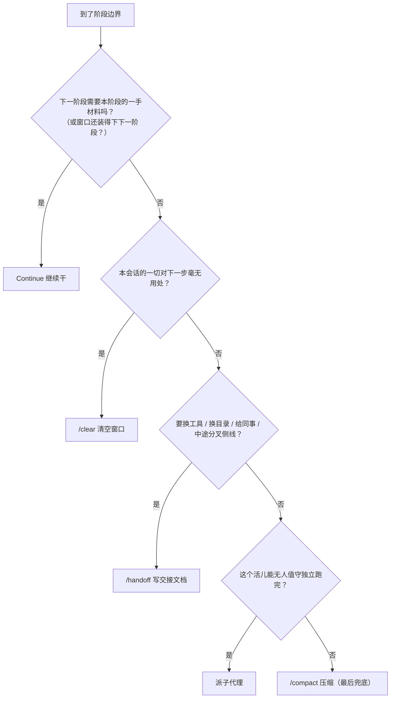

每个选项背后的账：

| 顺序 | 选项 | 为什么 | 一句话记忆 |
|---|---|---|---|
| 1 | **Continue** | 拷问→施工是标准「是」：施工要的是推理过程原文，不是摘要。零成本零损失，**最先排除其他选项** | 能继续就继续 |
| 2 | **/clear** | 最便宜的一步：零耗时换回整个窗口。且 clear 不是终结，旧会话还能 resume。**代价是单向的**：把「有用的」clear 掉，why 就没了，读 diff 读不回来 | 没用了才清 |
| 3 | **/handoff** | 它买到的是**可携带性**（换工具、换目录、给别人）。清单之外的场景都算滥用 | 出远门才打包 |
| 4 | **子代理** | 标准场景：自动化审查。本会话窗口不受扰动 | 杂活外包 |
| 5 | **/compact** | 相关上下文 + 同工具 + 同目录 + 你得在场。**它是默认兜底，不是第一反应**——从它开始的人，结局是「新会话对着被摘要压扁的决策自信地干错事」 | 压缩是无奈 |

背后的原理是**一手 / 二手材料**之别：

```text
一手（Continue）       ：信息全 / 噪声多 / 腾挪空间小   ← 像现场录音
二手（compact/handoff）：有损   / 噪声少 / 腾挪空间大   ← 像会议纪要
```

Continue 以外的每个选项，都是把「当时发生的会话」换成「对它的摘要」。只有当「留下的成本」超过「有损的代价」时才换。

**高频疑问一：仓库太大，光读代码就把窗口吃满了，怎么办？**

先澄清这条纪律管什么：它防的是**把同一段思考切碎**——拷问中「为什么选 A 不选 B」的推理过程，是 spec 里 Implementation Decisions 一节的原料，被 compact 压扁了 spec 就写残。它**不是**要求把仓库装进窗口。**主窗口里该装的是讨论与决策，不是代码。**大仓库的代码自有三处去处：

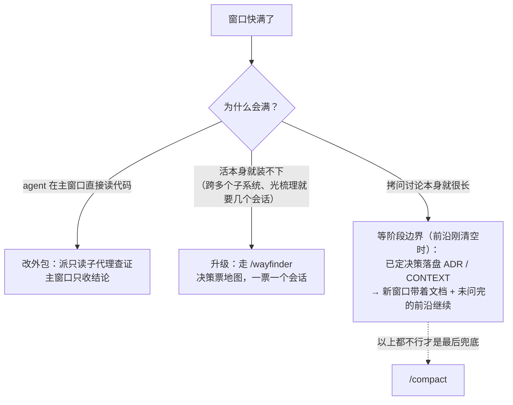

**（1）读代码外包给子代理。**拷问时查环境是 agent 的活（3.1 铁分工）：派一个只读子代理去翻，只带结论回主窗口：

```text
主窗口（拷问进行中）              子代理（用完即弃）
┌────────────────────┐        ┌──────────────────────────┐
│ 设计树 + 你的回答     │        │ 翻几十个文件、跑十几次 grep  │
│ 几千~几万 token      │ ←结论─ │ 烧掉几十万 token 也不心疼    │
│ 「取消入口有两个：     │        └──────────────────────────┘
│  API 与后台手动，     │
│  都收敛到             │
│  CancelService」     │
└────────────────────┘
```

例子：你提「支持部分退款」，agent 需要知道现有取消逻辑长什么样——它派子代理（Claude Code 里就是 Explore 这类只读子代理）去读，子代理翻完回主窗口一句「取消入口两个，都收敛到 CancelService」，**主窗口只花这几十个 token，读代码的几十万 token 烧在子代理自己的窗口里，用完整个扔掉**。「读代码理解需求」这个动作同理：它是**查事实**，不是**做决策**——决策在主窗口，查证在子代理窗口。而且查事实不阻塞提问：等子代理回报的只有挂在它下游的问题，前沿其余的照问（3.1）。

**（2）贵结论沉淀成外存文档。**子代理翻出来的结论（「取消都收敛到 CancelService」这类），如果跟着拷问落进 CONTEXT.md / ADR / 领域文档，下一个会话直接引用、不用重翻。这就是 writing-for-agents 的「只有查起来贵的缓存才配存在」（8.6）——大仓库的解药不只是一个大窗口，更是**让每个新窗口不从零开始**的外存。走完这条链的产物——spec 和票——本来就是自包含的（写行为契约、禁路径行号），所以施工阶段每张票开新窗口只吃票文件，大仓库对施工窗口同样不构成压力。

**（3）活本身装不下 → 升级成迷雾工程。**如果「理解现状」就是大头——需求横跨多个子系统、光梳理清楚就要好几个会话——它已经不是「一条需求」，入口改走 wayfinder（4.3）：地图就是为「装不下」设计的，每个决策票开自己的会话，主会话只载一张低清地图。

最后是**窗口已经堆满了的兜底姿势**：等一个阶段边界（前沿刚清空的时刻就是），先按上面的五问走；若确实装不下下一阶段，最好的动作不是 /compact，而是**把已定决策先落盘**（grill-with-docs 本来就边拷问边写 ADR / CONTEXT），带着「落盘的决策 + 还没问完的前沿清单」开新窗口继续拷问——损失的是一点推理温度，保住的是决策记录的完整。/compact 是五问里的最后兜底，不是这里的默认答案。

**高频疑问二：拷问很长，用 /handoff 换个窗口吗？**

不是。handoff 的定位是**窄门**（五问第三问），四个合法场景：换工具、换目录、给同事、中途分叉侧线——共同点是**下一个会话要去「别的地方」干活**。handoff 买到的是**可携带性**：交接文档是行李，先有「换地方」，行李才有意义；人还站在原地，是不用打包的。判决问题一句话：**「下一个会话在哪儿干活？」**

拷问很长时，仍按五问顺序走一遍：

```text
第一问：下一阶段需要一手材料吗？
  → 拷问是标准「是」（spec 要的就是推理原文）→ Continue，什么都不用做
    （只有「窗口还装得下吗」这半句否掉它，才往下走）
第二问：本会话一切都没用了？
  → 拷问内容对 spec 有用 → 不是 clear
第三问：下个会话要在别处干活吗？（换工具 / 换目录 / 给同事 / 分侧线）
  → 不换 → 不是 handoff   ←「拷问长」本身不满足这一问
第四问：能无人值守跑完吗？
  → 拷问要你亲自答问题 → 不能
第五问：/compact 兜底
  → 「拷问太长 + 还在原地」的落点，但它是无奈，不是默认
```

比 /compact 更好的变体，就是高频疑问一说的「落盘续拷」：grill-with-docs 本来就边拷问边把已定决策写成 ADR / CONTEXT——**落盘文件是一手材料（决策的完整记录），不是摘要**，带着「落盘文档 + 未问完的前沿清单」开新窗口，损失比 compact 压摘要小得多。但换窗口毕竟有代价（推理温度），所以它仍是兜底，不是「拷问长了就换窗口」的常规操作。

**handoff 最典型的合法场景：原型岔路（3.2）。**

```text
主线（拷问进行中，原目录）              侧线（原型，另一个目录）
      │
      ├── /handoff 出去 ──────────→  开新会话做 /prototype
      │    （行李：拷问上下文）           （状态机 HTML，拉产品点两轮）
      │                                      │
      ├── 继续拷问其他前沿 ←──────── /handoff 回来
      │    （行李：原型验证的结论）         结束即弃
```

侧线**换了目录**（原型代码有自己的目录，跟主线天然隔离），而且主线还得继续——交接文档是两个会话之间的**桥**，双向各用一次。

| 情况 | 用什么 | 一句话理由 |
|---|---|---|
| 拷问很长，窗口还够 | **什么都不用**，继续 | 第一问优先：下一阶段要一手材料 |
| 拷问很长，装不下，还在原地 | 已定决策**落盘** + 新窗口续拷 | 换的是窗口，不是地方；落盘是一手材料，比 compact 的摘要损失小 |
| 要去原型目录 / 换工具 / 给同事 | **/handoff** | 下个会话在别处，行李才有用 |

一个反向验证：handoff 自己的纪律（第 7 节）是「别的工件已有的内容**只引用不复制**」——决策都落盘了，handoff 文档就只剩「下个会话该调哪些 skill + 几个指针」的薄壳。行李越轻，越说明大部分东西本来就该在盘上，而不是在会话里。

---

## 4. 三条匝道：工作不从「想法」进来时怎么进流程

第 3 节的主流程，起点是「一个想法」：你想做点什么，拷问、spec、切票、施工。但现实里的工作不总是从这门进来的：

- **别人把活卸到你门口**：用户在 tracker 上提了一堆 bug 报告和需求，一件件等着处理；
- **路走着走着爆胎了**：线上炸了个疑难 bug，或者性能莫名回退；
- **要去的地方还没有路**：接了个全新的大项目，或者一个横跨多个系统的超大特性。

这三种活各有专门的入口（上游叫 on-ramp，高速路的匝道——起点不在主路上，但最后都汇入主路，也就是第 3 节的主流程）：

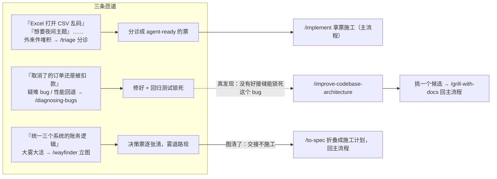

### 4.1 匝道一：triage——分诊（外来件的门卫）

先看两个外来件进门的命运——分诊的全部机制，都藏在这两个故事里：

- 用户 A 提了个 issue：「导出的 CSV 用 Excel 打开是乱码」。triage 读完全部上下文，判断是 bug，然后**亲自按报告者的步骤复现**——真的乱码，主张成立。于是写好 agent brief（写「CSV 导出应默认带 UTF-8 BOM」这样的行为契约，不写路径行号），状态推到 `ready-for-agent`。一张票进了施工队列，等 `/implement` 来领。
- 用户 B 提了个 issue：「后台想要夜间主题」。triage 先查 `.out-of-scope/` 知识库——命中 `dark-mode.md`：这个概念之前拒过，理由是后台是白天办公场景，夜间使用率不到 1%。端出来回复：「之前拒过，理由如下，您还是这个意见吗？」维护者看了，维持原判——关票进 `wontfix`，知识库的历史请求清单加一行。

同一个门进来，一个变成施工票，一个进了拒绝档案。triage 的分工是**只分诊「不是你自己造的票」**：bug 报告、外部需求、带着代码来的外部 PR（pull request，往主仓合并代码的申请单）。自己 `/to-tickets` 切出来的票天生 agent-ready，**别再 triage 它们**（上游原文警告）。

- **状态机**：每个 issue 同一时刻恰好打一个类别（`bug` 或 `enhancement`）+ 一个状态。冲突就停下来问维护者；PR 被当作「带代码的 issue」走同一台机器。

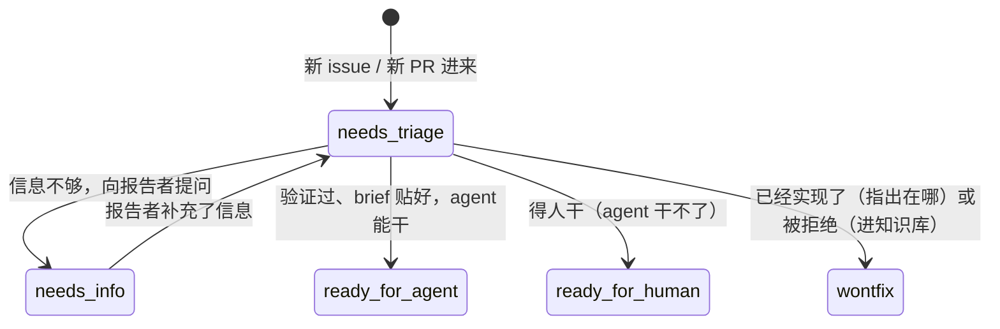

- **每次出手都先自报家门**：在 tracker 上发的每条评论必须以 `> *This was generated by AI during triage.*` 开头（告诉人这条是 AI 写的）。
- **流程**：读全量上下文（含历史分诊笔记，不重复问已答的问题）→ 给出类别 / 状态建议**等维护者点头** → **验证主张**（bug 亲自按报告者步骤复现；PR 亲自 checkout 跑测试——验证过的分诊能写出强得多的 brief）→ 需要补肉就上 grilling + domain-modeling → 落结果。
- **`ready-for-agent` = 贴 agent brief**（AGENT-BRIEF.md），它是「无人值守 agent 干活的合同」。核心原则**耐久优先于精确**：票可能在队列里躺几周，代码早变了——所以描述接口、类型、行为契约，禁止文件路径和行号：

```text
✗ 脆的写法（两周后就变成误导）：
   打开 src/types/skill.ts，在第 42 行给 SkillConfig 加一个 schedule 字段

✓ 耐久的写法（代码怎么挪都还对）：
   SkillConfig 类型应接受一个可选的 schedule 字段；
   缺省时行为与今天完全一致
```

  其他三条 brief 纪律：验收标准**具体可测、彼此独立可验证**（「Triage 应该正常工作」不合格）；**显式写明 Out of scope**，防止 agent 镀金或自作主张动相邻功能；写「该怎样」不写「怎么改」。
- **`wontfix` 分两种出口**：功能**其实已经实现了**——关票并指出在哪，**不写**知识库；功能**被拒绝**（enhancement）——写入 `.out-of-scope/` 知识库。
- **`.out-of-scope/` 知识库**：一个概念一个文件（不是一票一个），记录决策、理由（要实质理由，不收「最近太忙」这种伪拒绝）、历史请求清单。比如仓库顶层的 `.out-of-scope/dark-mode.md`：

```markdown
# 夜间主题

## 决策
不做。

## 理由
管理后台是白天办公场景使用的工具，夜间使用率 <1%（2026-03 埋点）。

## 历史请求
- #42（2026-03）
- #87（2026-07）
```

  下次分诊先查这个库，按**概念相似度**匹配（有人提「深色模式」也能命中 `dark-mode.md`）。命中就端出来：「之前拒过，理由如下，您还是这个意见吗？」维护者可以**确认**（关票）/ **翻案**（删文件重走流程）/ **认为不是一回事**（当新需求处理）。
- 维护者也可以直接「快改档」：「把 #42 挪到 ready-for-agent」——照办，跳过拷问，但会问一句要不要补 brief。

### 4.2 匝道二：diagnosing-bugs——调试（翻车③的解药）

六阶段纪律。**核心宣言：建反馈回路这一步，就是这个 skill 本身。**先说它的逻辑：医生不做检查就开药是谋财害命；agent 不建回路就提假说，是同一个错误——全部判断建立在「感觉是这样」上。

先看一个疑难 bug 的全程缩略版，六阶段的节奏都在里面（每步的机制下面逐个展开）：

> 一条线上报告：「用户取消了订单，第二天还是被扣了款」。**Phase 1 建回路**：agent 不碰产品代码，先写一个失败测试——「已取消的订单不应重试」——在故障场景上 2 秒稳定变红（就是下面那条命令）。**Phase 2 复现 + 最小化**：确认红的确实是「取消后仍重试」这个症状本身，然后一次剪掉一个变量，拿到最小复现。**Phase 3 假说**：不急着改代码，先产出三条排序的假说、每条带预言（就是下面那份清单），排好序亮给用户——用户一句「上周我们刚改过重试模块」，清单当场重排。**Phase 4 插桩**：对排第一的假说下断点，一次只改一个变量，证实。**Phase 5 修复 + 回归**：Phase 2 的最小复现直接升级成回归测试，写在修复之前、在旧代码上红，修复后变绿。**Phase 6 清场**：调试日志一次 grep 清零，真凶写进 commit message。

- **Phase 1 建回路**（「不惜血本、放聪明点、拒绝放弃」）：目标是造出一个**紧（tight）**的信号——一条命令，能在这个 bug 上稳定变红。skill 给了十条从优到劣的造法：失败测试 → curl 脚本 → CLI + 快照对比 → 无头浏览器 → 重放录制的 trace → 一次性 harness → 属性 / 模糊循环 → bisect harness → 新旧版本差分 → 最后手段：把「必须人点鼠标」的步骤也写成脚本管起来。

  一条合格的回路命令长这样：

```bash
$ go test ./internal/judge -run TestCancelledOrderNotRetried
--- FAIL: TestCancelledOrderNotRetried (0.02s)
    judge_test.go:118: 已取消的订单被重试了 1 次，应为 0 次
```

  2 秒、确定性、红在**用户报告的那个症状**上。

  造出来还要**拧紧**：更快（缓存 setup）、信号更锐（断言具体症状而非「没崩」）、更确定（钉住时间、固定随机种子、冻结网络）。**「30 秒的 flaky 回路几乎等于没有；2 秒确定性的回路是调试超能力。」**

  非确定性 bug：目标不是干净复现，是**抬高复现率**——循环 100 次、加压、缩小时序窗口。「50% 复现率的 flaky 可调试，1% 的不可。」

  **收工清单**：红得了（断言的是用户的原始症状）、确定、秒级、agent 可独立跑。**清单达成之前禁止读代码提假说**——「跳过回路直接提假说，恰恰是这个 skill 要防的失败」。

  **先脱敏**：一切要展示的命令 / 输出 / 抓包先 `<REDACTED>`（抹掉敏感值），凭据留在环境变量里。

- **Phase 2 复现 + 最小化**：先确认红的是「用户描述的那个 bug」而不是邻居 bug；然后一次剪掉一个变量（删一个依赖、去掉一层配置），直到**剩下的每个元素都是承重的**——删掉任何一个就变绿。最小复现缩小 Phase 3 的假说空间，还直接成为 Phase 5 的回归测试。

- **Phase 3 假说**：先产出 **3–5 个排序的、可证伪的**假说，再动手测（只提一个假说会锚定思维）。每个假说必须说出**预言**——说不出口的假说是幻觉，扔。排好序**先亮给用户**——一句「我们上周刚发布了重试模块的变更」就能重排你的清单。

```text
假说清单（按可能性排序，每条必须带预言）：
1. 重试消费者没处理死信        → 预言：清空死信队列后 bug 消失
2. 网关超时后客户端重复提交     → 预言：抓包看同一订单是否有两次 POST
3. 状态机漏了「取消中」中间态   → 预言：构造慢取消场景，观察是否双次回调
```

- **Phase 4 插桩**：每个探针对应一个具体预言；**一次只改一个变量**。优先级：断点 / REPL > 定向日志 > **永不**「全量日志然后 grep」。所有调试日志打唯一前缀（如 `[DEBUG-a4f2]`），收尾时一次 grep 清干净。性能问题单独一条纪律：**先测出基线再二分，先测量后修复**——日志通常是错误的工具。

- **Phase 5 修复 + 回归测试**：回归测试写在修复**之前**——先看它在旧代码上红，再让修复变绿。但只在有**正确的接缝**时才写得进去；如果发现没有合适的接缝能锁死这个 bug，**「没有接缝」本身就是发现**——架构在阻止这个 bug 被锁死，转交 `improve-codebase-architecture`（见 4.3 之后的场景五）。

- **Phase 6 清场**：原始场景不再复现 / 回归测试过 / 调试插桩 grep 清零 / 一次性产物删除 / **真凶假说写进 commit message**——让下一个调试的人学到。

### 4.3 匝道三：wayfinder——大雾里的导航

先感受一下什么叫「雾」。你接到一个活：「把散落在订单、支付、对账三个系统的账务逻辑统一」。拷问了半小时你就发现不对劲：每敲定一个决策，马上打开三个新问题——「金额用什么表示？」「整数分。」「那历史浮点数据怎么迁？跨币种怎么算？精度边界谁定？」——而新问题又依赖别的还没定的决策。照这个速度，一个会话窗口根本装不下这次工程的全貌：**不是不知道答案，是连「该问什么」都还没问全**。这就是雾，也是 wayfinder 的领地。

适用场景由此而来：**一个会话装不下、且前面全是雾**的工程——绿地项目、超大特性。和 `grill-with-docs` 的分工：后者加工「一个会话装得下的想法」，wayfinder 处理「装不下的那个」。它刻意做得**又慢又重**，所以只配给真正的迷雾工程——边界清楚的小特性用它就是杀鸡用牛刀。

核心概念：

- **地图（map）**：tracker 上一个带 `wayfinder:map` 标签的 issue，是唯一权威工件。它是**索引不是仓库**——只记「至今的决策」一行摘要 + 链接，细节永远只住在票里。一张地图长这样：

```markdown
# wayfinder：账务系统重构

## Decisions so far（至今的决策，每条一行 + 链接）
- 金额一律用整数分存储，禁浮点 → 见 #3
- 对账以平台流水为事实源 → 见 #7

## Not yet specified（雾区：看得到要来，还说不精确）
- 退款和提现的先后序问题
- 多币种怎么落

## Out of scope（已裁决不做）
- 支持法币以外的资产
```

- **决策票**：地图的子 issue，装的是**问题**不是施工切片。四型：`research`（查资料型，可无人值守派子代理）/ `prototype`（做原型型，需要人参与）/ `grilling`（拷问型，默认型，总是同时调 grilling + domain-modeling）/ `task`（手工活型——为了解锁决策必须先干的事）。

  关键边界：**拷问型的票只有真人参与才能解决——agent 永远不许替人回答它自己提出的问题**（「拷问 agent 自己回答自己的问题是犯规」）。

- **雾区毕业**：解一票会吹开它前面的雾，把变得能说清楚的问题**立成新票**。判据一句话：**「你现在能不能把问题说精确」——注意不是「你现在能不能回答它」。**能说精确 → 立票（哪怕暂时被阻塞）；说不出 → 留在雾区，**不许提前把雾切成票的形状**（一团雾毕业后可能变成好几张票，也可能啥也不是）。

- **领票即占坑**：开工前先把票 assign 给自己，并发会话靠 assignee 判定占用。阻塞用 tracker 原生 blocking 关系——前沿（所有阻塞已清的票）直接在 tracker UI 里可视化，人不用打开地图就知道现在能干啥。

两种用法：

1. **立图（chart）**：拷问定目的地（destination 决定一切）→ 广度优先拷问铺前沿 → 发现根本没雾就**停**（不需要地图，问用户想怎么干）→ 建地图 → 立当前能立的新生票，**第二遍**再接阻塞边（issue 得先有 id 才能互相引用）→ 每个 research 票放一个并行子代理去解 → **停手**。立图就是立图，一张票都不亲手解。
2. **推图（work）**：载入低清地图 → 选票（用户点名算数，没点名就取前沿第一张）→ **先 claim 再干活** → 解一票（需要谁的知识就调谁的 skill）→ 决议写进解决评论、关票、往地图的 Decisions-so-far 追加一行指针 → **长新票 + 雾区毕业**；发现某票其实越过目的地，关票进 Out of scope 而不是硬解。**一个会话最多解一张票**（research 票例外）。

**最重要的一条边界：图清了就交接，不施工。**出图回到主流程 `/to-spec`，把地图上链接的一堆决策**折叠成可施工的计划**，再 `/to-tickets`、`/implement`。跳过折叠直接施工，等于把关联的决策细节全扔了。

---

## 5. 六种典型场景怎么走（完整路径）

前面讲的是机制。这一节回答实际问题：**我手头这个活，从头到尾该敲什么？**六种最常见的开发任务，每种给一条完整路径。

### 5.1 场景一：全新的代码开发（绿地项目）

特征：从零起一个项目 / 模块，没有历史包袱，但前面全是雾——技术选型、模块划分、数据模型都还没定。

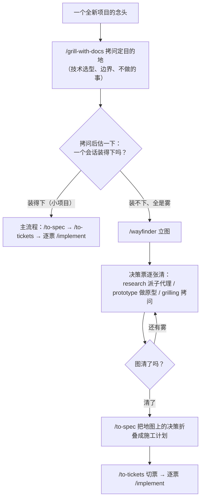

这个场景的要点：

- **别一上来就立图**。wayfinder 又慢又重，先拷问——如果发现根本没雾（一路清清楚楚），上游原文说**停**，不需要地图，直接问用户想怎么干。
- **绿地项目的特权与代价**：没有历史约束，拷问可以畅想；但正因如此，带锁死效应的选型（存储、协议、框架）**该立 ADR 就立**——六个月后你想改，代价是全推倒。
- **图清了交接不施工**（4.3 的铁律）：wayfinder 产决策不产代码。

### 5.2 场景二：已有仓库的新需求开发（标准主流程）

特征：仓库已经存在，要加一个新功能。这是最高频的场景，就是第 3 节的主干。

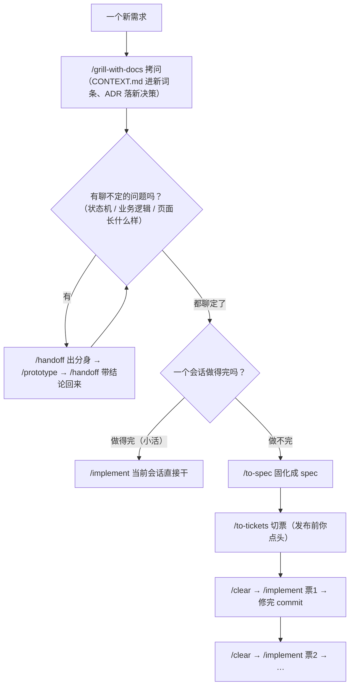

这个场景的要点：

- **窗口纪律**（3.5）：拷问 → spec → 切票在一条不间断的窗口里完成；每张票的 implement 换新窗口，只吃票文件。
- **拷问中顺手落档**：术语进 CONTEXT.md、够格的决策进 ADR。本仓（aha）把这条加严为「决策先行、且先于 spec 落盘」（见第 12 节）。
- **小活可以不写 spec**：上游主流程明确「一个会话做得完就直接 implement」。写 spec 是为了跨会话携带信息，单会话装得下的活别为流程而流程。

### 5.3 场景三：已有需求的变更，要推翻之前的设计

特征：功能已经在那了（甚至已经上线），但当初的设计要推翻重来——比如「当初整单取消的设计不支持部分退款，现在业务要部分退款」。

**上游没有一张专门的「改需求」skill，这个场景走的是几条既有机制的组合**（下面每一步都标了出处）：

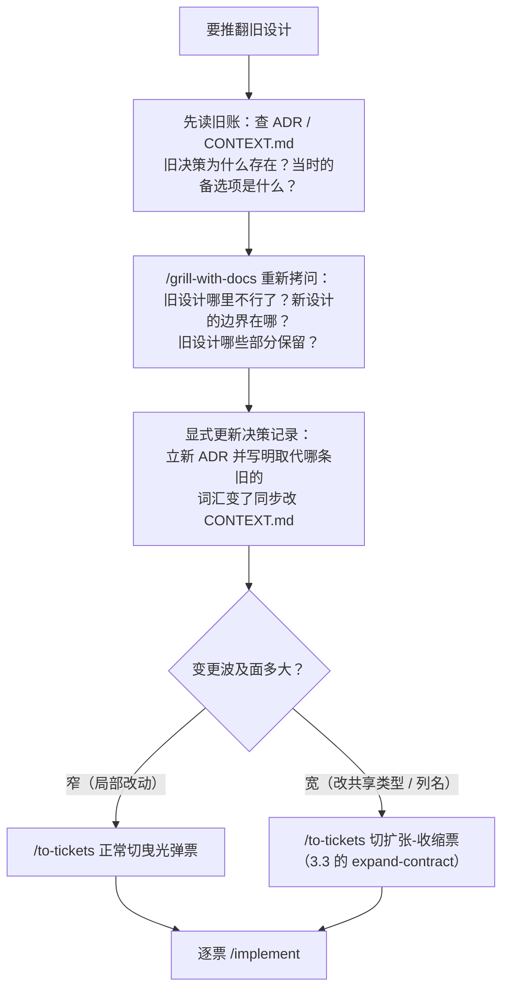

逐步展开：

1. **先读旧账，再动手**。ADR 存在的意义就在这一刻：如果旧决策当年立了 ADR，你能看到当时的理由和备选项——也许新需求其实当年的备选项里就有（那是翻旧案，理由充分）；也许旧决策的理由今天依然成立（那要重新谈，不是推翻）。如果没立过 ADR，`domain-modeling` 的「跟代码对质」动作（6.1）就是干这个的：代码告诉你现状是什么，拷问告诉你为什么。
2. **重新拷问，不许跳过**。「推翻」是一个比新需求更容易想当然的场景——你脑子里已经有旧设计的形状，新设计很容易只是「旧设计的补丁」。让 grilling 把新设计的树画全。
3. **显式更新决策记录，不许悄悄改**。旧 ADR 不能违反了还留在那误导人：立新 ADR，正文写明取代关系（「取代 ADR-XXXX，原因：……」）。这和「对显然路径的刻意偏离要记档」是同一条原则的反向应用。被推翻的需求如果当初是被**拒绝**的外部 enhancement（在 `.out-of-scope/` 有账），翻案 = 删掉那个文件重走流程（4.1）。
4. **已切未做的票要重切**：agent 绝不自己改票（2.1 铁律 1 的后果），叫人重跑 `/to-tickets` 调整票和阻塞边。
5. **波及面宽的变更走扩张-收缩**，不要硬切曳光弹——改共享类型签名这种事，一个票里几千个调用点一起改，CI 保不住绿。

这个场景的坑：**最危险的动词是「顺手」**——「顺手把旧逻辑改了」「顺手把那个 ADR 说的做法绕开了」。上游体系的答案很一致：任何对既有决策的偏离，要么在拷问里谈透并留档，要么别做。

### 5.4 场景四：bug 排查和修复

特征：某个行为不对 / 性能回退，或外部 bug 报告堆积。

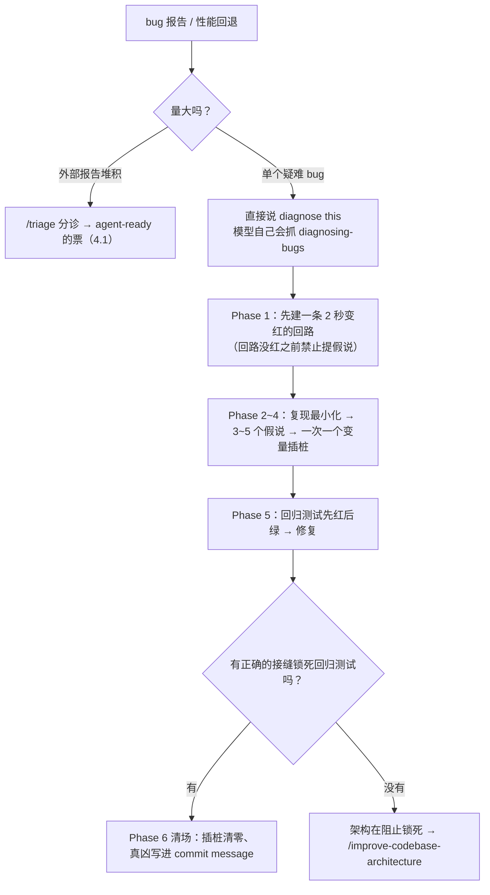

**triage 和 diagnosing-bugs 怎么分工？**两者不是竞争关系，是同一批 bug 流水线上的前后两站。一句话定位：**triage 是门卫——决定「这个 bug 是真的吗、要不要修、谁来修」，不修车；diagnosing-bugs 是修车师傅——只接已经确认要修的车，负责修好。**

| | triage（4.1） | diagnosing-bugs（4.2） |
|---|---|---|
| **进的是什么** | 未验证的外来主张：别人报告的 bug、外部需求（它只分诊「不是你自己造的票」） | 已确认要查的问题：自己撞上的疑难 bug，或分诊验证过、brief 已贴好的那张票 |
| **出的是什么** | 一张票：验证过的主张 + agent brief → `ready-for-agent` | 一次修复：回归测试 + commit message 里的真凶分析 |
| **复现的目的** | 只为证实主张成立（按报告者步骤跑一遍，症状真的在——到此为止） | 复现只是起点，目的是拿到一条 2 秒变红的信号，一路挖到根因 |

同一个动作「复现」，两边深度完全不同：门卫复现是敲门砖（证实就收），师傅复现是地基（要在它上面建回路、剪变量、提假说）。

```text
bug 报告堆成山（未验证）
      │
      ▼  /triage（人敲命令）
  亲自复现 → 主张成立 → 写 brief（行为契约+验收标准）→ ready-for-agent
      │                     └ 主张不成立 → needs-info / wontfix
      ▼
  一张 agent-ready 的票
      │
      ▼  /implement 领票施工
  简单 bug：brief 已写清行为契约 → 直接修 + 回归测试
  疑难 bug / 性能回退：施工时驱动 diagnosing-bugs 六阶段
      ▼
  修复 + 回归测试 + commit 里写真凶
```

triage 的验证恰恰让后面的修复更省——上游原文说「验证过的分诊能写出强得多的 brief」：门卫复现时发现的线索（触发条件、影响范围）直接写进 brief，师傅领票时不是从零开始。

判断口诀：

| 你的处境 | 用什么 |
|---|---|
| 一堆**没验证过**的报告 / 需求堆着，不知道哪些真、哪些值得修 | `/triage`（批量进门管理） |
| 一个**已确认**的疑难 bug / 性能回退，要挖根因 | 直接说 "diagnose this"（模型自己会抓） |
| 只有一件报告，但你**已亲自复现确认**了 | 不用走 triage 流程，直接 diagnose——门卫的活你已经干完了 |
| 简单 bug、一眼能看出问题 | 走票：brief 写清行为契约，`implement` 直接修——六阶段是为「疑难」准备的 |
| 修到 Phase 5 发现没有接缝能锁死回归测试 | diagnosing-bugs 内部转手 `/improve-codebase-architecture`（不是退回 triage） |

为什么一个要人扣扳机、一个说话就行？这是 2.1 那根轴的活例子：**修不修、wontfix、给谁修，是资源分配决策，必须人做主**——triage 是 user-invoked，给建议等你点头；**六阶段调试是可复用的干活纪律**，不涉及「要不要」只涉及「怎么干」——diagnosing-bugs 是 model-invoked，你描述症状的那一刻它就该被用上，不需要你记得它的名字。

这个场景的要点：

- **顺序是死的**：回路没红之前不许提假说（4.2 收工清单）。这条最容易被人（和 agent）的急性子破坏。
- **修完的产物是两件**：回归测试 + commit message 里的真凶分析。只改代码不留测试的修复，在这个体系里不算修完。

### 5.5 场景五：代码重构

特征：行为不变，结构要变。重构在这个体系里有**三种入口**，先分清你走的是哪个：

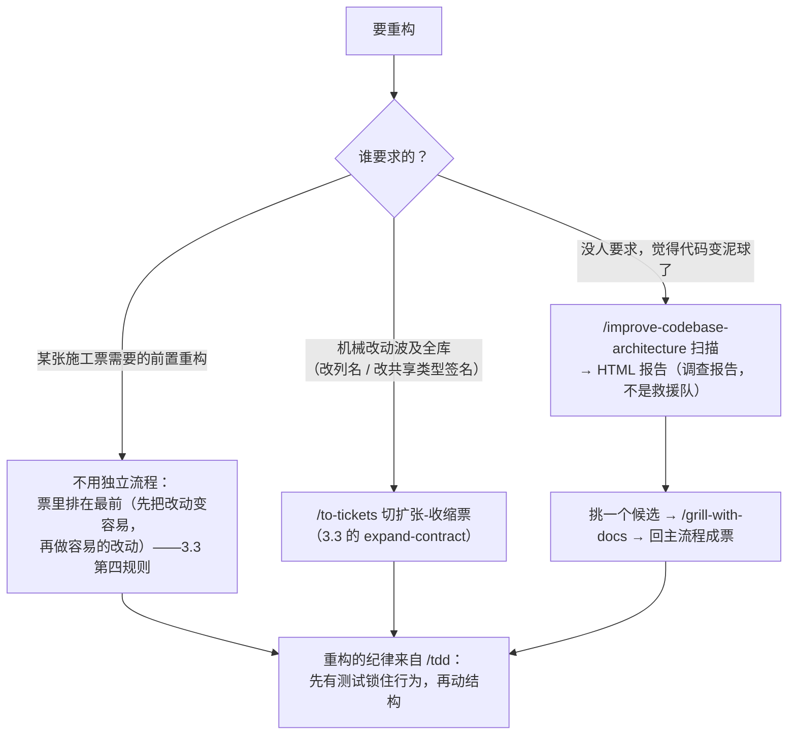

这个场景的要点：

- **「觉得烂」不是重构的理由，「报告说烂在哪」才是**。improve-codebase-architecture 出的是调查报告，挑候选、立项、施工都要回主流程走——几天跑一次，不是天天跑。
- **重构和测试的顺序**：tdd 的红绿循环里 refactor 是第三步——先有绿测试锁住行为，再动结构，动的过程中测试保持绿。没有测试保护的重构不是重构，是赌博。
- **宽重构别硬切**：扩张-收缩是唯一合法形态（3.3）。

### 5.6 场景六：文档梳理

特征：文档烂了——过时、死链、和代码对不上、越写越长没人看。**上游同样没有专门的 skill，也是组合拳**；本仓在这上面长出了自己的扩展。

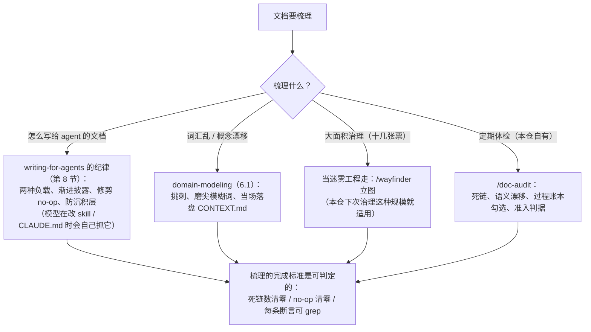

这个场景的要点：

- **写法问题的药方在 writing-for-agents**：文档越写越长的病根通常是该披露的没披露（8.3）、no-op 没删（8.6）、沉积层越积越厚（8.6）——修剪判据都是可操作的，不是玄学。
- **大面积治理要流程化**：如果梳理涉及几十个文件、互相牵连的决策（哪些文档是真相源、旧文档删不删），它就是一场迷雾工程。本仓 2026-09 的文档治理改造（ADR-0018~0020 + 16 张票）规模上正是这种活，当时走的是本仓自己的流程；上游的 wayfinder（4.3）是干这个的现成方法，下次可直接用。
- **别把 CONTEXT.md 梳理成杂物抽屉**：它是词汇表，不是 spec、不是草稿纸（6.1 的纪律）。
- **本仓自有 /doc-audit**：上游没有这个 skill，是本仓长出来的领域扩展——扫活文档死链、抓「文档断言 vs 代码事实」的语义漂移、查过程账本状态。

---

## 6. 垫在底下的两块词汇层（模型自己够的）

这两个 skill 不在流程里占步骤，是「底座」——被上面的 skill 在需要时调用，你也可以在「问题出在**词**上」时直接抓。

### 6.1 domain-modeling——领域模型的主动维护

**它和「查一下词汇表」的界限**（上游专门划过）：干活时顺手查 CONTEXT.md 是一行习惯，不算这个 skill；**主动改模型**才算——挑刺、造边界场景、当场落盘。五种动作：

1. **拿词汇表挑刺**：你用了和 CONTEXT.md 冲突的词，当场点破——「你的词汇表把『取消』定义为 X，你现在说的像是 Y。哪个对？」
2. **磨尖模糊词**：「你说『账户』——是 Customer 还是 User？这是两个东西。」
3. **造具体场景压测**：拿边界场景去撞领域关系，逼人把概念边界说清。
4. **跟代码对质**：「你的代码是整单取消，你刚说支持部分取消。哪个是对的？」
5. **当场落盘**：术语一敲定立刻更新 CONTEXT.md，**不许攒批**。

**CONTEXT.md 的纪律**：它是**纯词汇表**——「不要把它当 spec、当草稿纸、当实现决策的仓库」。只有本项目特有的概念进得来（超时、错误类型这类通用编程概念不配）。一个词条长这样：

```markdown
### 判决（verdict）
llmsec 对一次工具调用的裁决结果，取值 allow / block / ask。
_Avoid_: 结论、裁定（历史上三个词混用，2026-06 统一为「判决」）
```

多上下文大仓在根上放 `CONTEXT-MAP.md`，指到各上下文自己的 CONTEXT.md。文件**懒创建**：有第一个词条才建。

**ADR 的三条件**（缺一不立）：

1. **难以逆转**——改主意的代价实打实；
2. **没有上下文会让人惊讶**——后来者看到代码会问「为什么这么干？」；
3. **真实权衡的产物**——有过认真的备选项，你是为了具体理由选的。

格式刻意极简：**「一个 ADR 可以只有一个段落。」**模板就是标题 + 1–3 句话（什么背景、定了什么、为什么），可选段（Status / Considered Options / Consequences）只在真有增量时加。一个三句话的 ADR 长这样：

```markdown
# ADR-0012：审计日志只落本地

判决已落盘 audit.log 且已上传控制面，本地再推一份给 llmsec 是双写，
增加故障面且无消费方。决定：审计日志只落本地文件，滚动 30 天。
（背景：2026-08 拷问中曾考虑双写，被否。）
```

配得上 ADR 的东西：架构形态、上下文间集成模式、带锁死效应的技术选型（不是每个库都配）、边界与 scope 决策（**「明确不做」和「做」一样值钱**）、对显然路径的刻意偏离（防止后人好心「修好」你的刻意设计）、代码里看不见的约束（合规要求、200ms 时延红线）、非显然的拒绝（六个月后有人再提 GraphQL 时有账可查）。

### 6.2 codebase-design——深模块设计的共享词汇

翻车④的理论底座（Ousterhout《A Philosophy of Software Design》+ Feathers 的 seam 概念）。**七个词，用到死，不许换近义词**（"component / service / API / boundary" 都被点名禁用，各有理由——有的被别的概念占了，有的太窄）：

| 术语 | 定义 | 禁用词 |
|---|---|---|
| **Module 模块** | 有接口有实现的任何东西。刻意尺度无关：一个函数、一个类、一个包、跨层的竖片都算 | unit, component, service |
| **Interface 接口** | 调用方正确使用它必须知道的一切：类型签名 + 不变量 + 顺序约束 + 错误模式 + 必需配置 + 性能特征 | API, signature（太窄） |
| **Depth 深度** | 接口处的杠杆率：调用方每学一单位接口能驱动多少行为。深的 = 小接口藏大实现；浅的 = 接口复杂度和实现差不多 | — |
| **Seam 接缝** | 不改这个地方就能改变行为的位置（Feathers）；模块接口所在之处。接缝放哪本身就是设计决策 | boundary（被领域驱动设计的「限界上下文」占了） |
| **Adapter 适配器** | 在接缝上满足接口的具体实现。说的是**角色**不是材质 | — |
| **Leverage 杠杆** | 深度给调用方的红利：一份实现，N 个调用点和 M 个测试摊销 | — |
| **Locality 局部性** | 深度给维护者的红利：改动、bug、知识、验证集中在一处。改一处 = 全修 | — |

深模块和浅模块的对比：

| | 深模块（追求这个） | 浅模块（避免） |
|---|---|---|
| 接口 | 2 个方法，参数简单 | 15 个方法，参数复杂 |
| 实现 | 800 行，逻辑都藏在这 | 30 行，全是对别处的转发 |
| 调用方 | 学 2 个方法，得到 800 行的行为 | 学 15 个方法，得到 30 行的转发 |

几条核心判据：

- **删除测试（the deletion test）**：想象删掉这个模块。复杂度凭空消失 → 它是个转发器（白养着）；复杂度在 N 个调用点重新冒出来 → 它在挣饭吃。
- **接口即测试面**：调用方和测试走同一条接缝。如果你想「穿过接口去测内部」，说明模块形状不对。
- **一个 adapter 是假想接缝，两个 adapter 才是真接缝**：没有东西在接缝两侧变化，这个接缝就是纯间接层。例：你给 `PayGateway` 接缝写了一个 `StripeAdapter`，然后永远只有这一个——这层接缝目前是白绕的；等测试里出现 `FakeAdapter`、或第二个支付渠道出现，接缝才算立住。
- **可测性三招**：

```go
// ✗ 依赖藏在内部：想测就得真调 Stripe
func ProcessOrder(o Order) {
    gw := NewStripeGateway()
    gw.Charge(o)
}

// ✓ 依赖从接口注入：测试里塞一个假网关
func ProcessOrder(o Order, gw PaymentGateway) {
    gw.Charge(o)
}

// ✓ 返回结果而非原地副作用：测试直接拿返回值比对
func CalculateDiscount(cart Cart) Discount
```

- **加深四类依赖**（DEEPENING.md）：进程内纯计算 → 直接合并、直接测；本地可替换的（本地 PGLite 代 Postgres）→ 用替身测；**远程但自有的服务 → 在接缝上定接口，生产用 HTTP adapter、测试用内存 adapter**；真外部服务 → 注入 mock adapter。配套测试策略 **replace, don't layer（替换，不叠层）**：深模块接口测试立起来后，旧浅模块的单测直接删。
- **Design It Twice（一个设计想两遍）**：对选中的加深候选，并行放 3+ 个子代理各设计一版**彻底不同**的接口（一个极简接口、一个极致灵活、一个面向最常见调用方优化、一个 ports & adapters——「端口与适配器」，一种把业务内核和外部世界隔离的架构模式），然后按深度 / 局部性 / 接缝位置对比，**最后给出明确推荐**——「用户要的是一个强判断，不是一张菜单」。

---

## 7. 独立散件速览

- **`research`**（模型自调）：后台子代理查**一手资料**（官方文档、源码、规范），每个论断追到源头，落成带引用的 md。产出是喂给 `/grill-with-docs` 的**素材**，不是结论替代品。
- **`resolving-merge-conflicts`**（模型自调，独立于一切流程）：五步——看现状 → **找每边的 primary source**（commit message、PR、原 issue，理解「当时为什么改」）→ 逐块按意图解（能保两边意图就保，保不了就按合并目标选边并记下取舍；**不发明新行为**）→ 跑自动化检查 → **收完整个 merge / rebase，永不 `--abort`**。
- **`wizard`**（模型自调）：agent 撞到「只有人能过的墙」——去第三方后台点按钮、配 CI secrets、一次性割接——时不把编号步骤倒进聊天里祈祷你照做，而是**生成一个交互式 bash 向导**。跑起来是逐屏推进的：

```text
┌ 第 2 步 / 共 5 步 ────────────────────────────┐
│ 在 Cloudflare 后台创建 API Token              │
│                                              │
│ 已为你打开: https://dash.cloudflare.com/...   │
│ 请在页面上: My Profile → API Tokens → Create  │
│                                              │
│ 粘贴生成的 Token（输入不会回显）: ▒▒▒▒▒▒▒▒     │
│ ✔ 已写入 .env（变量名 CLOUDFLARE_TOKEN）       │
│                                              │
│ 按 Enter 继续，还剩 3 步                       │
└──────────────────────────────────────────────┘
```

  纪律：**绝不虚构界面上可能不存在的步骤**，不知道就问或查文档；UX 底座（template.sh 的库函数）全仓统一、**永不手改**，agent 只负责划步骤；自验只做静态检查（`bash -n` 语法 + shellcheck + 追每个值的落点），**从不自己跑**（会开浏览器、会卡在等人）；默认用完即删。
- **`handoff`**（人扣扳机）：把当前对话压缩成交接文档，写进**系统临时目录**（不进工作区）。纪律：别的工件（spec、ADR、票、commit）已有的内容**只引用不复制**；脱敏；文档里附「下个会话该调哪些 skill」。**窄门**：只用于换工具 / 换目录 / 给同事 / 中途分叉（3.5 五问的第三问）。
- **`to-questionnaire`**（人扣扳机）：卡你的是**别人脑子里的知识**时用。精髓：**「拷问寄信，不拷问主题」**——两轮问答只问「寄给谁（角色 / 专长 / 关系）」和「你要拿回什么」，问卷正文的问题全部瞄准这两者的差值。问题按重要性降序（异步可能只有一轮机会），每题一个概念不复合，带答题占位符，可能被误读的题加一行「为什么这重要」。
- **`wait-what`**（人扣扳机）：一句话的 skill，agent 没讲明白时的紧急刹车——「用 ASD-STE100 简明技术英语（一种规定只用常用词、短句的国际简明英语规范）+ CONTEXT.md 的统一语言重讲一遍」。和 grill-with-docs 的关系：后者是**事前预防**（语言先对齐，黑话根本到不了你耳朵里），这个是**事后补救**。
- **`teach`**（人扣扳机）：把当前目录变成有状态的教学工作区（MISSION.md 学习使命 / lessons 教学页 / reference 速查卡 / learning-records 学习记录 / RESOURCES.md 资源库 / assets 可复用组件 / NOTES.md 偏好）。教育学味最浓的一个：区分 **fluency（现场提取）与 storage strength（长期存储）**，用检索练习、间隔、交错制造「合意困难」；课程要落在**最近发展区**（zone of proximal development，跳一跳够得着的难度带）；测验选项**字数必须一样多**（不许用排版泄露答案）；「智慧」不自己教，介绍高质量社区去练。
- **`writing-for-agents`**（模型自调）：元技能，下一节单讲。

---

## 8. 元哲学：writing-for-agents——给 agent 写文档的手艺

这一节是整套仓库的「文法」，理解它才能看懂上面所有 skill 为什么长那样。核心主张一句话：**文档的作用不是让 agent 每次产出一致的结果，而是让它每次走一致的过程。**

### 8.1 两种负载

每个文档、每个指针都花两种预算之一：

- **上下文负载（context load）**：常驻 agent 窗口的材料（CLAUDE.md 的一行、skill 的 description）每回合都在花 token 和注意力，管它 fired 没 fired。
- **认知负载（cognitive load）**：花在**人**身上——「有哪些文档、啥时候用哪个」。**人就是索引**。这不是要最小化的成本，而是「人保持掌控」的价格：该花在人判断要紧处，不该花的地方删掉。

类比：上下文负载像**贴在墙上的便利贴**——每面墙就那么大，贴一张占一张；认知负载像**你脑子里的备忘**——不占墙，但你得记得有这回事。人扣扳机的 skill 把东西收进抽屉（省墙、费脑子），模型自己够的 skill 把东西贴墙上（费墙、省脑子）。2.1 节那根轴本质上就是在两种负载间做选择。

### 8.2 上下文指针（context pointer）

agent 上下文里「点名某份窗口外的材料 + 说清什么条件够到它」的引用，就是上下文指针。**指针的措辞（而不是它指的目标）决定 agent 会不会去够、够得稳不稳。**

```text
✗ 弱指针：详见 CONTRIBUTING.md
   （agent 不知道什么条件下该去读，多半不去）

✓ 强指针：提交前需要走发布流程吗？分三种情况——
   打版本号   → 读 docs/release.md 第 1 节；
   只改文档   → 跳过发布，直接提 PR；
   改了对外接口 → 除 release.md 外还要读 docs/compat.md。
   （每种情形一个分支，agent 一对照就知道自己属于哪种、该够哪份）
```

写指针的规矩：说清材料是什么 + 列全**触发分支**（branch = 文档处理的一种不同情形）；每个分支一条触发描述，同义改写算同一个分支，写两遍就合并。常驻指针每个词每回合都花钱，所以比正文更要狠剪。

### 8.3 信息层级与渐进披露

文档内容由两种料混成：**steps（按序执行的动作）**和 **reference（按需查阅的定义 / 规则 / 事实）**。按「agent 多急需要它」排三级：

1. **文内 step**（主体：agent 按顺序干的事）
2. **文内 reference**（按需查；一屋子平级规则摊一排没问题，不是坏味道）
3. **披露的 reference**（推到别的文件，靠指针够到，指到了才加载）

**渐进披露（progressive disclosure）就是往下挪**，首要目的不是省 token，是**保住层级**：该披露的不披露，step 会被 reference 埋掉，agent 读着读着忘了自己正在执行哪一步、下一步干什么。披露的干净判据是**分支**：所有分支都需要的，内联；只有部分分支够得着的，推到指针后面。

文内排布讲究 **co-location（同地而居）**：一个概念的定义、规则、注意事项收在同一个标题下，「读一处，邻居顺带走」。失败形态叫 **sprawl（摊大饼）**：每行都活着但文档太长，注意力摊薄——药方还是往下披露 + 按分支 / 序列拆分。

### 8.4 完成标准（completion criterion）

每个 step 必须以**完成标准**收尾——agent 能分清「做完了」和「没做完」的那条线。

```text
✗ 含糊：和解用户的反馈
   （什么叫「和解」？agent 会抢跑宣布完成）

✓ 清楚：用户在原帖回复「确认解决」，
   或沉默超过 7 天后你留下第三次回复
```

含糊的界线会招来 **premature completion（抢跑）**——没做完就宣布做完了。防御顺序：**先磨尖界线**（局部、便宜）；只有界线确实磨不尖**且**观察到抢跑，才把后面的 step 藏起来（拆分序列——但只有真上下文边界才藏得住，同一个窗口里的调用藏不住）。

「要求量（demand）」是另一个杠杆：「每个改动的模型都有交代」逼出彻底的活，「产出一份变更清单」逼不出。要求量还驱动 **legwork（腿脚功夫）**——藏在措辞里的、agent 自己得去刨的功课。比如「每条规则都过一遍」绑住一整排平级 reference，这就是为什么纯 reference 文档也能带穷举性要求。

### 8.5 引导词（leading word）

**一个已经活在模型预训练里的紧凑概念，agent 靠它边跑边想**（lesson、fog of war、tracer bullets……）。以 token 的形式（从不以句子的形式）反复出现，累积出分布式定义，用最少的 token 锚住一整片行为——因为它免费征用了模型已有的先验。

精髓是**一个词换一整段**：

- "fast, deterministic, low-overhead" → **tight**（一个 tight loop）
- "a loop you believe in" → **red**（模糊的门变成二元可观测量：回路红没红）

自造词也行，但自造词没有先验可征，「省下的定义钱又得花回去」——所以优先找现成的词。这个仓库本身就是范例：tracer bullet、fog of war、frontier、primary source、deep module……每个词都是引导词。

**反例是负向表述**：用禁止来导航，会把禁止的东西拽进上下文，让它**更**显眼（「别想大象」——满脑子都是大象）；禁令半读半疑就成了做那件事的指令。**正向表述目标行为**（「写一行注释」而不是「别写三行注释」），禁令只留给无法正向化的硬护栏，且旁边永远配上正向目标。

### 8.6 修剪

- **单一事实源**：一个含义只活在一个地方，改行为 = 改一处。重复既费维护又费 token，还把这个含义在层级里的存在感虚抬到超出实际地位。（注意和引导词不矛盾：引导词重复的是 token，不是含义。）
- **环境也是事实源**（package.json 脚本、配置文件、目录结构、`--help` 输出）：文档复述环境就是在写**缓存**——只有「查起来贵」的缓存才配存在。该写进文档的是 agent 查不到的东西：没写下来的惯例、选择背后的理由、配置文件不会自首的坑。一次查询就能拿到的，留给环境（它不会过时）。
- **逐行查相关性**：这行还服务于文档要干的事吗？（纯展示、该披露的分支、随世界变化失效的陈述都不相关。）不加修剪的默认命运叫 **sediment（沉积层）**：加一句觉得安全、删一句觉得危险，陈旧层越积越厚，最后得从中间掏着找还活着的话。
- **逐句抓 no-op（无效指令）**：模型默认就会照办的指令，白花负载说了个寂寞。判据「相比默认改变了行为吗？」是**相对于模型的**，不是相对于读者的——两个人吵一句是不是 no-op，其实是在吵模型的默认行为，该用跑文档实测解决，不用辩论。杀 no-op 时**删整句**，不从句子里抠字眼。连引导词也受检验：压不过默认的弱词（"be thorough"）换更强的词（"relentless"），而不是换技巧。

---

## 9. 怎么装、怎么起步

### 9.1 两条安装路线，**二选一**

| | Claude Code 插件 | skills.sh 安装器 |
|---|---|---|
| 命令 | `claude plugins install mattpocock-skills`（会话内 `/plugin install mattpocock-skills`） | `npx skills@latest add mattpocock/skills`（单装一个：`--skill=<name>`，更新：`npx skills update <name>`） |
| 哲学 | **订阅**：托管只读 bundle，作者发版你自动收到更新 | **分叉**：普通文件拷进你的仓库，你拥有、你随便改，啥时候想同步上游自己拉 |
| 适合 | 想白嫖维护的人 | 想改造的人 |

上游原话警告：**都装 = 每个 skill 得到两份**。本仓（aha）就是「分叉」路线的活样本——skill 被拷进来后按自己需求改过。

为什么插件只出了 Claude Code 版没有 Codex 版？上游 ADR-0002 记了账：Codex 的插件清单只收单个路径字符串，没法表达「只要正式发布的那两个桶」这个子集（指向整个 skills/ 会把试水和自留桶全带出去；用符号链接做精选目录，Codex 安装时会把 symlink 丢掉、技能变空）。2026-08 已进 Claude Code 官方插件市场（`claude-plugins-official`），用户零配置可装。

### 9.2 每仓一次：`/setup-matt-pocock-skills`

先探索后提问，三节配置（探索已能定的直接跳过，不烦你）：

1. **Section A — issue tracker**：issue 住哪。`git remote` 指向 GitHub 就默认 GitHub（用 `gh` CLI）；GitLab 用 `glab`；也可以选**本地 markdown**（issue 以文件形式住 `.scratch/<feature>/`）或「其他」（你用一段话描述 Jira / Linear 的工作流，它记成自由文本）。落盘为 `docs/agents/issue-tracker.md`。「外部 PR 是否算分诊入口」有个默认关闭的开关，不主动提，想要的人自己翻文件去开。
2. **Section B — 分诊标签**：只问一个问题：「用默认五标签吗？」（`needs-triage` / `needs-info` / `ready-for-agent` / `ready-for-human` / `wontfix`）。你的 tracker 已有别的叫法才说不。
3. **Section C — 领域文档布局**：默认单上下文（根 `CONTEXT.md` + `docs/adr/`），不问直接写；只有探索到 monorepo 信号才提供多上下文（`CONTEXT-MAP.md` 分仓）选项。

产出：三个 `docs/agents/*.md` 配置文件 + 往 `CLAUDE.md`（没有就 `AGENTS.md`，**两个都存在时只改已有的那个，绝不两边建**）里加一个 `## Agent skills` 块。写之前给你看草稿、允许改。

上游 ADR-0001 还给「依赖 setup」分了级：**硬依赖**（to-spec、to-tickets、triage——没配置就输出错误的东西）在正文里写死「没配置就去跑 /setup」；**软依赖**（tdd、diagnosing-bugs、improve-codebase-architecture——没文档只是不够锐）只用含糊的「项目领域词汇表」带过，省 token，避免跟风写没用的配置指针。

### 9.3 本地 markdown tracker 的形状（本仓正在用的就是这个）

`.scratch/<feature-slug>/spec.md`（spec）+ `.scratch/<feature-slug>/issues/NN-<slug>.md`（一票一文件，从 01 编号）+ 票文件顶部 `Status:` 行记分诊状态 + `## Comments` 追加讨论。wayfinder 的地图落 `.scratch/<effort>/map.md`，票上的 `Blocked by: NN, NN` 行就是阻塞边，前沿 = 开放 + 无阻塞 + 未 claim 的票按编号取第一。

---

## 10. 日常速查

### 10.1 场景 → 用什么

| 你现在的处境 | 敲什么 |
|---|---|
| 有个想法 / 要改个东西，还没想透 | `/grill-with-docs`（有仓库）或 `/grill-me`（没仓库） |
| 忘了该用哪个 | `/ask-matt` |
| 想法聊透了，固化下来 | `/to-spec` |
| spec 要开工，切票 | `/to-tickets` |
| 票在手，开写 | `/implement`（每张票开新会话，先 `/clear`） |
| 代码写完想查一遍 | `/code-review since <基点>` |
| 出了疑难 bug / 性能回退 | 直接说 "diagnose this"——模型会自己抓 `diagnosing-bugs` |
| 合并冲突解得头大 | 说 "resolve this conflict"——模型抓 `resolving-merge-conflicts` |
| bug 报告 / 外部需求堆成山 | `/triage` |
| 工程大到一个会话装不下 | `/wayfinder` |
| 觉得代码库开始变泥球 | `/improve-codebase-architecture`（几天一次） |
| 状态机 / 逻辑嘴上论证不动 | 让 agent 出逻辑原型（它会自己抓 `prototype`） |
| 页面长什么样拿不定 | 让 agent 出 UI 原型变体 |
| 需要查资料 | 让 agent `/research`（它自己会抓） |
| 撞上只有人能干的活（配后台 / 密钥） | agent 会自己生成 `/wizard` 向导 |
| agent 说的没听懂 | `/wait-what` |
| 卡在别人脑子里的知识 | `/to-questionnaire` |
| 换会话 / 换机器 / 给同事 | `/handoff` |
| 想系统学个东西 | `/teach` |
| 想给 agent 写 / 改文档（skill、CLAUDE.md） | `/writing-for-agents`（模型在干这活时会自己抓） |

（最常见的六种任务的**完整路径**——从第一脚到收尾——见第 5 节；这张表是「下一步敲什么」，那节是「全程怎么走」。）

### 10.2 一条新需求的典型一天

```text
09:00  /grill-with-docs          → 40 分钟拷问，CONTEXT.md 进两个新词条
10:00  （中途发现状态机聊不定）
       /handoff 出去 → /prototype 单文件 HTML → 拉产品点了两轮
       → /handoff 带结论回来
11:00  回到拷问，前沿清空，确认共识
11:30  /to-spec                  → spec 发布，ready-for-agent
13:00  /to-tickets               → 草案 5 票，砍成 4 票，批准发布
14:00  /clear → /implement 票1   → /tdd 红绿三片 → /code-review 两轴各 2 条发现
       → 修完 → commit
15:30  /clear → /implement 票2   → ……
17:00  （发现票3 依赖的接口形状不对）→ 叫用户跑 /to-tickets 重新切，绝不自己改票
```

### 10.3 容易踩的坑（上游明文警告过的）

- **别 triage 自己切出来的票**——它们天生 agent-ready。
- **别把 CONTEXT.md 当杂物抽屉**——它是词汇表，不是 spec、不是草稿纸。
- **别滥立 ADR**——三条件缺一就不立；「最近太忙」这种是拖延不是拒绝，别进 out-of-scope 知识库。
- **别在干活干到一半 `/compact`**——窗口决策只发生在阶段边界；半路的选项只有「继续」或「拆子代理」。
- **别把 `/compact` 当第一反应**——它是五选项里的最后兜底。
- **别让原型代码进 main**——结论进真代码，原型本体进 `prototype/<name>` 分支当史料。
- **别给原型上测试**——「需要测试的原型已经不是原型」。
- **spec / 票 / brief 里别写文件路径和行号**——过时得飞快；写接口和行为契约。
- **别在 `/implement` 中途自己改票**——人扣扳机铁律：需要新票就叫人跑 `/to-tickets`。
- **wayfinder 出图后别直接施工**——先 `/to-spec` 折叠，否则决策细节全丢。
- **插件和 skills.sh 别都装**——两份一样的 skill。
- **mock 只 mock 系统边界**——外部 API、时间、随机数；自己的类不许 mock。
- **期望值不许用和被测代码一样的算法现算**——那是同义反复测试，永远不可能不同意代码。

---

## 11. 这套东西自己怎么治理自己（吃自己的狗粮）

这个仓库最有趣的次要看点：**它用自己教的方法管理自己**。

- 它有自己的 `CONTEXT.md`（词汇表：Issue tracker / Issue / Decision ticket / Triage role，每个词带 `_Avoid_` 列表，还有「已裁决的歧义」一节——比如 "backlog" 一词双义被禁用）。
- 它有自己的 ADR（`.agents/adr/`），前面引用的 ADR-0001/0002 用的正是它自己推的极简格式。
- 它有自己的 CLAUDE.md，规定桶结构、README 互链、文档页同步等门槛；`AGENTS.md` 是指向 CLAUDE.md 的符号链接（Codex 读同一份）。
- 它有自己的路由维护义务：「改了 skill 集合却没更新 ask-matt 的路由表 = 一个说谎的路由器（a router that lies）」。
- 版本走 changesets；`plugin.json` 的 version 与 `package.json` 联动；安装命令的措辞全仓唯一事实源（`.agents/install-block.md`），README、changeset、文档页统一从那抄，「页面不得自带安装命令，站方渲染的那份才是真的」。

---

## 12. 对照本仓（aha）：哪些是原装的，哪些本地化了

| 维度 | 上游原装 | 本仓现状 |
|---|---|---|
| 主流程 | grill → to-spec → to-tickets → implement | 一致，但**加严**：workflow.md 规定 ADR / CONTEXT 决策先行、且在 spec **之前**落盘（上游是拷问中顺手落）；决策文档不占票号 |
| issue tracker | GitHub 默认，本地 markdown 可选 | 本地 markdown，`.scratch/<feature>/issues/NN-<slug>.md`——与上游种子模板一字不差 |
| spec 落点 | 发布到 tracker 本体 | `.scratch/<feature>/spec.md`（本地 tracker 的约定），带 `Status:` 行 |
| 分诊 | 五角色状态机 | 五角色一致（`docs/agents/triage-labels.md`），还有「三筛立 ADR 占票号」的迁移特例 |
| 领域文档读法 | `docs/agents/domain.md` 由 setup 生成 | 同名文件在用 |
| 自有扩展 | — | `deploy-test`（真机 e2e 部署验证）、`doc-audit`（活文档体检）两个领域 skill，长在本仓 |
| 长寿文档治理 | ADR 极简（1–3 句），CONTEXT.md 纯词汇表 | ADR-0018 定了四类真相源与准入判据，比上游重；「明确不做 + 重议条件」与上游 ADR / `.out-of-scope/` 思想同源 |
| 完成标准 | implement 收尾 code-review 双轴 | workflow.md 的 `make vet / make test / 防回归` 三件套，同一精神（反馈回路） |

**值得继续借鉴的点**（本仓还没吃到的好处）：

- **wayfinder**：下次再遇到「文档治理」这种十几张票的迷雾工程，上游的决策票地图 + 雾区毕业是现成方法（见 5.6 场景六）。
- **agent brief 的耐久原则**（禁路径行号、写行为契约）：本仓票模板若还没明文禁路径，值得补。
- **阶段边界五问**：本仓施工节奏（按工单只暂存不提交、靠 `/clear` 换票）已经是这个思路，可以再把 `/compact` 纪律显式化。
- **out-of-scope 知识库**：本仓 ADR 的「明确不做」承担了同角色，但 `.out-of-scope/` 的「概念文件 + 历史请求清单 + 概念相似度匹配」对拒绝重复需求更机械好用。

---

## 13. 一段话总结

这套东西的全部内容可以压成四句话：

1. **人对齐**：动手前让 agent 把你拷问透（grilling），决策你的归你、事实它的归它。
2. **语言对齐**：项目黑话沉淀成 CONTEXT.md，难逆转的决策沉淀成 ADR，agent 从此用 1 个词说清 20 个词的事。
3. **反馈对齐**：测试先行、回路要紧（tight）、没红过就没资格提假说——反馈速度就是速度上限。
4. **结构对齐**：小接口藏大实现（deep module），每天投资设计，agent 加速写码的同时不让复杂度加速堆积。

而它管理「谁有权点火」的方式——**人扣扳机的编排层 + 模型自主够取的纪律层，两层永不互相越界**——是它区别于「全流程接管型」框架的根本：每个阶段切换点（写 spec、切票、分诊、立图）都握在你手里，agent 只在你扣完扳机后替你把活干满。

